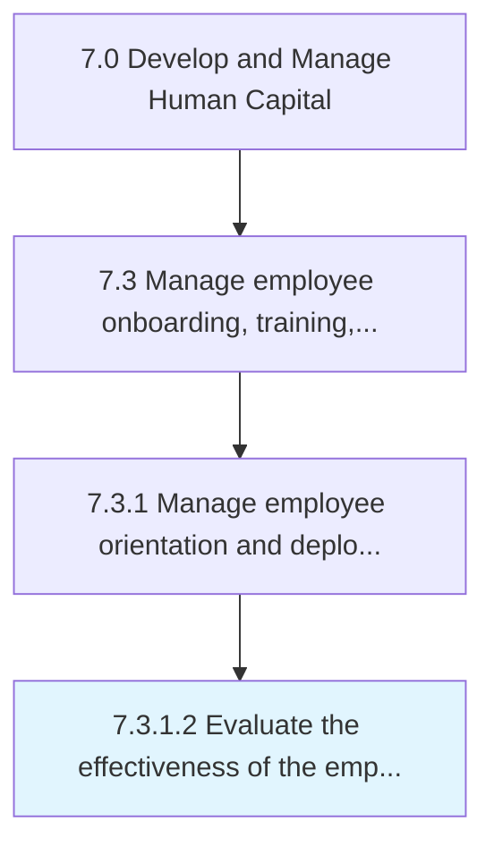

# Evaluate the effectiveness of the employee onboarding program

> Assessing the performance and effectiveness of employee on-boarding program.

## Overview

Activity 7.3.1.2 is an activity within the Develop and Manage Human Capital framework. 

Assessing the performance and effectiveness of employee on-boarding program. Examine the performance of on-boarding program through feedback and reviews from the new employees. Create web and written forms. Obtain information through face-to-face discussions.

## Process Hierarchy



## Key Statistics

| Metric | Value |
|--------|-------|
| APQC Code | 11243 |
| Hierarchy ID | 7.3.1.2 |
| Level | Activity |
| Parent | [7.3.1](../) |
| Sub-Processes | 0 |


## GraphDL Semantic Structure

```
evaluate.TheEffectiveness.of.TheEmployeeOnboardingProgram
```

| Component | Value | Description |
|-----------|-------|-------------|
| Verb | `evaluate` | Primary action |
| Object | `the effectiveness` | Direct object |
| Preposition | `of` | Relationship |
| PrepObject | `the employee onboarding program` | Indirect object |


## Related Concepts

- Effectiveness
- EmployeeOnboardingProgram


---

*Source: APQC PCF 11243 (7.3.1.2) - APQC*
