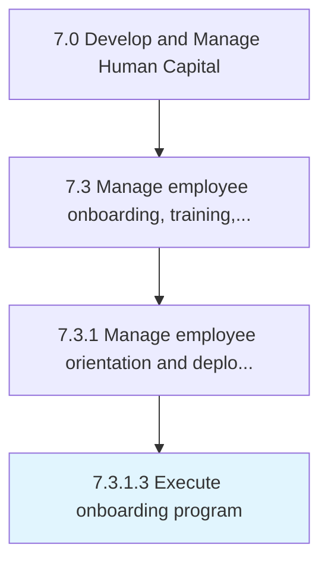

# Execute onboarding program

> Bringing the employee on-boarding program into effect.

## Overview

Activity 7.3.1.3 is an activity within the Develop and Manage Human Capital framework. 

Bringing the employee on-boarding program into effect. Implement Create/Maintain employee on-boarding program [10474]. Conduct training sessions and employee engagement programs.

## Process Hierarchy



## Key Statistics

| Metric | Value |
|--------|-------|
| APQC Code | 17050 |
| Hierarchy ID | 7.3.1.3 |
| Level | Activity |
| Parent | [7.3.1](../) |
| Sub-Processes | 0 |


## GraphDL Semantic Structure

```
execute.OnboardingProgram
```

| Component | Value | Description |
|-----------|-------|-------------|
| Verb | `execute` | Primary action |
| Object | `onboarding program` | Direct object |


## Related Concepts

- OnboardingProgram


---

*Source: APQC PCF 17050 (7.3.1.3) - APQC*
