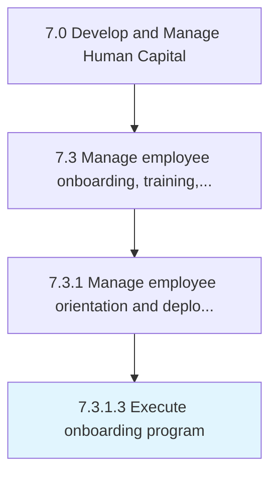
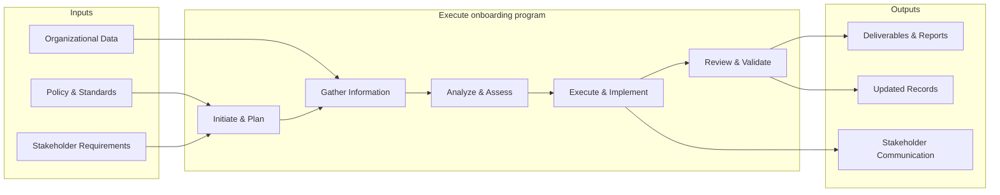

# Execute onboarding program

> Bringing the employee on-boarding program into effect.

## Overview

Activity 7.3.1.3 is an activity within the Develop and Manage Human Capital framework. 

Bringing the employee on-boarding program into effect. Implement Create/Maintain employee on-boarding program [10474]. Conduct training sessions and employee engagement programs.

This process encompasses the systematic execution of activities related to onboarding program. It involves planning, coordination, execution, and evaluation to ensure outcomes align with organizational objectives and industry best practices. The process requires cross-functional collaboration and adherence to established policies and regulatory requirements.

## Process Hierarchy



## Key Statistics

| Metric | Value |
|--------|-------|
| APQC Code | 17050 |
| Hierarchy ID | 7.3.1.3 |
| Level | Activity |
| Parent | [7.3.1](../) |
| Sub-Processes | 0 |


## GraphDL Semantic Structure

```graphdl
execute.OnboardingProgram
```

| Component | Value | Description |
|-----------|-------|-------------|
| Verb | `execute` | Primary action |
| Object | `onboarding program` | Direct object |


## Related Concepts

- OnboardingProgram


## Process Flow



## RACI Matrix

| Activity | Responsible | Accountable | Consulted | Informed |
|----------|------------|-------------|-----------|----------|
| Design training program | L&D Specialist | L&D Manager | Department Heads | HR Director |
| Conduct performance review | Manager | Department Head | HR Business Partner | Employee |
| Develop career plan | Employee | Manager | HR Business Partner | L&D Team |

## Related Occupations

- [Training and Development Managers](/occupations/Management/TrainingAndDevelopmentManagers)
- [Training and Development Specialists](/occupations/Business/TrainingAndDevelopmentSpecialists)
- [Human Resources Managers](/occupations/Management/HumanResourcesManagers)
- [Instructional Coordinators](/occupations/Education/InstructionalCoordinators)
- [Industrial-Organizational Psychologists](/occupations/Science/IndustrialOrganizationalPsychologists)

## Related Departments

- Human Resources
- Learning & Development
- Operations

## Industry Variations

### Healthcare

Requires mandatory continuing education (CME/CEU), clinical competency assessments, and compliance training for patient safety protocols.

### Financial Services

Emphasizes regulatory compliance training (SOX, AML, KYC), licensing requirements (Series 7, CFA), and ethics certification programs.

### Manufacturing

Focuses on safety certification (OSHA), equipment-specific training, lean/Six Sigma methodology, and apprenticeship programs.

## KPIs & Metrics

| Metric | Description | Target |
|--------|-------------|--------|
| Training Hours per Employee | Average annual training hours per employee | > 40 hours |
| Training Completion Rate | Percentage of assigned training completed on time | > 95% |
| Employee Performance Improvement | Percentage of employees improving performance ratings year-over-year | > 70% |
| Internal Promotion Rate | Percentage of open positions filled internally | > 30% |

---

*Source: APQC PCF 17050 (7.3.1.3) - APQC*
