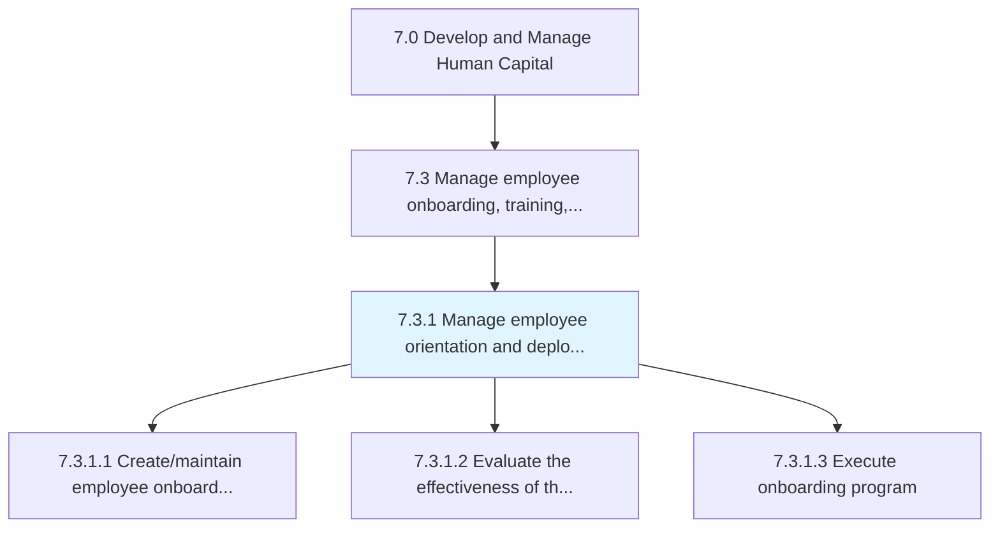
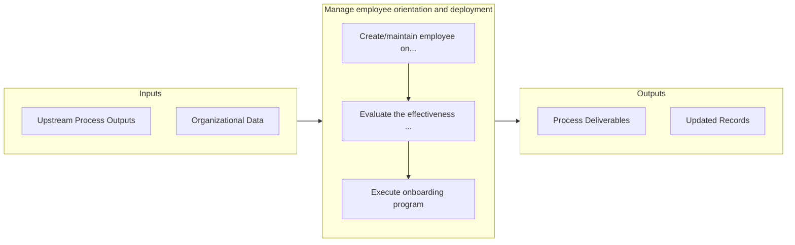

# Manage employee orientation and deployment

> Creating and maintaining various employee on-boarding programs typically known as induction programs in order to ensure that the new employees are effectively introduced to the organization and its existing employees.

## Overview

Process 7.3.1 is a core process that defines the specific procedures for manage employee orientation and deployment. 

Creating and maintaining various employee on-boarding programs typically known as induction programs in order to ensure that the new employees are effectively introduced to the organization and its existing employees. Examine and evaluate the performance of these induction programs. Execute these programs on the ground level.

## Process Hierarchy



## Key Statistics

| Metric | Value |
|--------|-------|
| APQC Code | 10469 |
| Hierarchy ID | 7.3.1 |
| Level | Process |
| Parent | [7.3](../) |
| Sub-Processes | 3 |


## GraphDL Semantic Structure

```
manage.EmployeeOrientationAndDeployment
```

| Component | Value | Description |
|-----------|-------|-------------|
| Verb | `manage` | Primary action |
| Object | `employee orientation and deployment` | Direct object |


## Process Flow



## Sub-Processes

| Process | Hierarchy ID | Description |
|---------|-------------|-------------|
| [Create/maintain employee onboarding program](./7.3.1.1-CreatemaintainEmployeeOnboardingProgram/) | 7.3.1.1 | Creating and maintaining a mechanism through which new employees acquire the necessary knowledge, sk |
| [Evaluate the effectiveness of the employee onboarding program](./EvaluateTheEffectivenessOfTheEmployeeOnboardingProgram) | 7.3.1.2 | Assessing the performance and effectiveness of employee on-boarding program |
| [Execute onboarding program](./ExecuteOnboardingProgram) | 7.3.1.3 | Bringing the employee on-boarding program into effect |


## Related Concepts

- [EmployeeOrientation](/concepts/EmployeeOrientation)
- [Deployment](/concepts/Deployment)


---

*Source: APQC PCF 10469 (7.3.1) - APQC*
