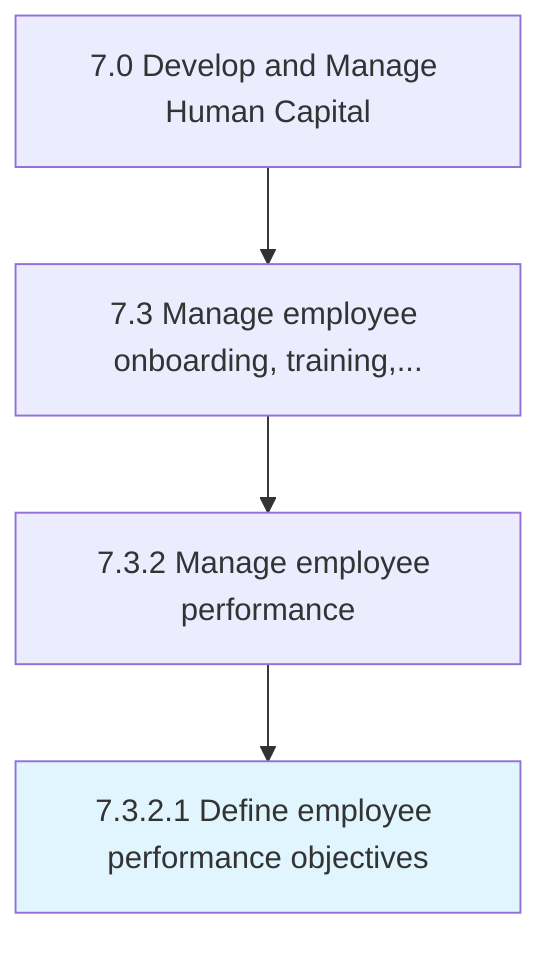
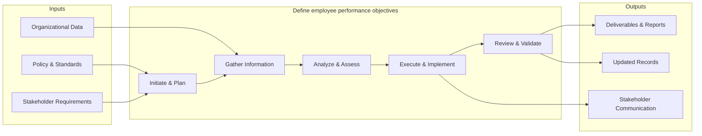

# Define employee performance objectives

> Outlining the objectives for employee performance.

## Overview

Activity 7.3.2.1 is an activity within the Develop and Manage Human Capital framework. 

Outlining the objectives for employee performance. Establish key performance objectives and measures such as customer-focus objectives, financially focused objectives, and employee growth objectives.

This process establishes clear definitions and frameworks for employee performance objectives. It involves stakeholder consultation, industry benchmarking, documentation of standards and criteria, and alignment with organizational strategy to ensure consistency and clarity across all business units.

## Process Hierarchy



## Key Statistics

| Metric | Value |
|--------|-------|
| APQC Code | 10479 |
| Hierarchy ID | 7.3.2.1 |
| Level | Activity |
| Parent | [7.3.2](../) |
| Sub-Processes | 0 |


## GraphDL Semantic Structure

```
define.EmployeePerformanceObjectives
```

| Component | Value | Description |
|-----------|-------|-------------|
| Verb | `define` | Primary action |
| Object | `employee performance objectives` | Direct object |


## Related Concepts

- EmployeePerformanceObjectives


## Process Flow



## RACI Matrix

| Activity | Responsible | Accountable | Consulted | Informed |
|----------|------------|-------------|-----------|----------|
| Design training program | L&D Specialist | L&D Manager | Department Heads | HR Director |
| Conduct performance review | Manager | Department Head | HR Business Partner | Employee |
| Develop career plan | Employee | Manager | HR Business Partner | L&D Team |

## Related Occupations

- [Training and Development Managers](/occupations/TrainingAndDevelopmentManagers)
- [Training and Development Specialists](/occupations/TrainingAndDevelopmentSpecialists)
- [Human Resources Managers](/occupations/HumanResourcesManagers)
- [Instructional Coordinators](/occupations/InstructionalCoordinators)
- [Industrial-Organizational Psychologists](/occupations/IndustrialOrganizationalPsychologists)

## Related Departments

- Human Resources
- Learning & Development
- Operations

## Industry Variations

### Healthcare

Requires mandatory continuing education (CME/CEU), clinical competency assessments, and compliance training for patient safety protocols.

### Financial Services

Emphasizes regulatory compliance training (SOX, AML, KYC), licensing requirements (Series 7, CFA), and ethics certification programs.

### Manufacturing

Focuses on safety certification (OSHA), equipment-specific training, lean/Six Sigma methodology, and apprenticeship programs.

## KPIs & Metrics

| Metric | Description | Target |
|--------|-------------|--------|
| Training Hours per Employee | Average annual training hours per employee | > 40 hours |
| Training Completion Rate | Percentage of assigned training completed on time | > 95% |
| Employee Performance Improvement | Percentage of employees improving performance ratings year-over-year | > 70% |
| Internal Promotion Rate | Percentage of open positions filled internally | > 30% |

---

*Source: APQC PCF 10479 (7.3.2.1) - APQC*
