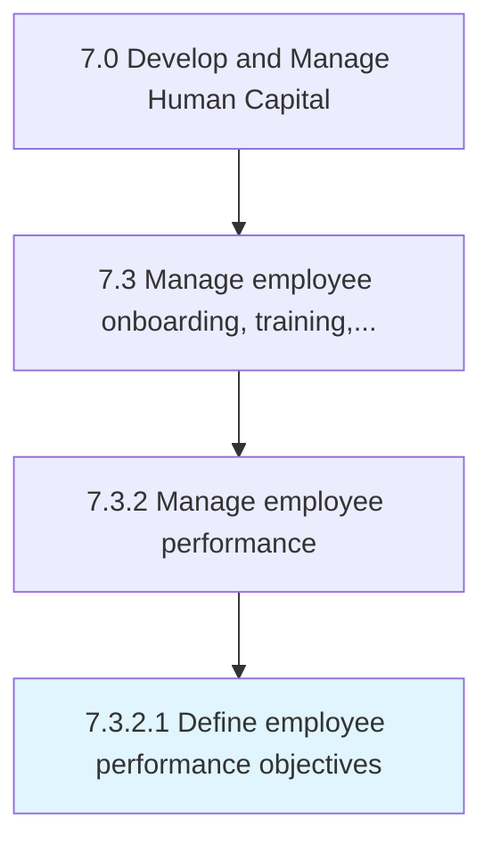

# Define employee performance objectives

> Outlining the objectives for employee performance.

## Overview

Activity 7.3.2.1 is an activity within the Develop and Manage Human Capital framework. 

Outlining the objectives for employee performance. Establish key performance objectives and measures such as customer-focus objectives, financially focused objectives, and employee growth objectives.

## Process Hierarchy



## Key Statistics

| Metric | Value |
|--------|-------|
| APQC Code | 10479 |
| Hierarchy ID | 7.3.2.1 |
| Level | Activity |
| Parent | [7.3.2](../) |
| Sub-Processes | 0 |


## GraphDL Semantic Structure

```
define.EmployeePerformanceObjectives
```

| Component | Value | Description |
|-----------|-------|-------------|
| Verb | `define` | Primary action |
| Object | `employee performance objectives` | Direct object |


## Related Concepts

- EmployeePerformanceObjectives


---

*Source: APQC PCF 10479 (7.3.2.1) - APQC*
