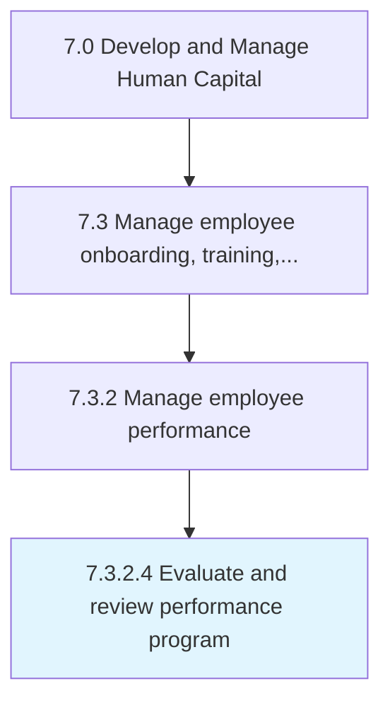

# Evaluate and review performance program

> Assessing and revamping performance programs, including the instruments used to measure employee performance standards.

## Overview

Activity 7.3.2.4 is an activity within the Develop and Manage Human Capital framework. 

Assessing and revamping performance programs, including the instruments used to measure employee performance standards. Review and upgrade these performance programs to avoid any deprivations and ensure effectiveness.

## Process Hierarchy



## Key Statistics

| Metric | Value |
|--------|-------|
| APQC Code | 10481 |
| Hierarchy ID | 7.3.2.4 |
| Level | Activity |
| Parent | [7.3.2](../) |
| Sub-Processes | 0 |


## GraphDL Semantic Structure

```
evaluate.AndReviewPerformanceProgram
```

| Component | Value | Description |
|-----------|-------|-------------|
| Verb | `evaluate` | Primary action |
| Object | `and review performance program` | Direct object |


## Related Concepts

- [PerformanceProgram](/concepts/PerformanceProgram)
- [PerformanceProgram](/concepts/PerformanceProgram)


---

*Source: APQC PCF 10481 (7.3.2.4) - APQC*
