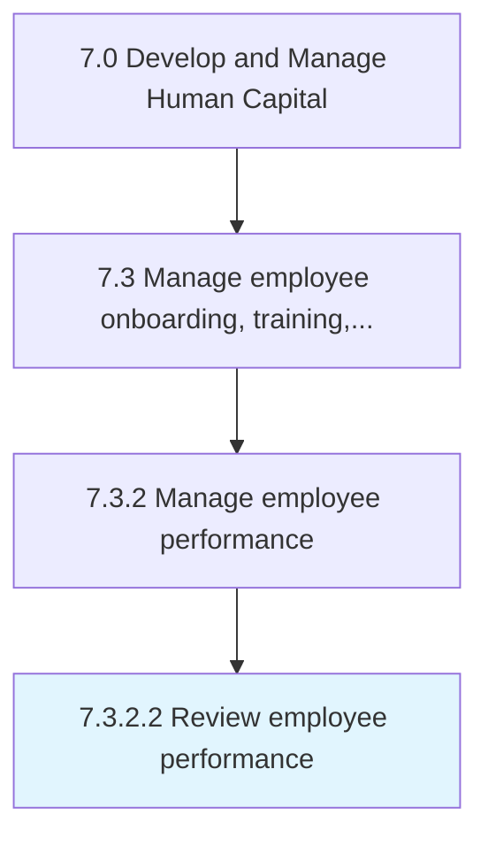

# Review employee performance

> Execution of employee reviews/performance on a frequent basis.

## Overview

Activity 7.3.2.2 is an activity within the Develop and Manage Human Capital framework. 

Execution of employee reviews/performance on a frequent basis.

## Process Hierarchy



## Key Statistics

| Metric | Value |
|--------|-------|
| APQC Code | 21434 |
| Hierarchy ID | 7.3.2.2 |
| Level | Activity |
| Parent | [7.3.2](../) |
| Sub-Processes | 0 |


## GraphDL Semantic Structure

```
review.EmployeePerformance
```

| Component | Value | Description |
|-----------|-------|-------------|
| Verb | `review` | Primary action |
| Object | `employee performance` | Direct object |


## Related Concepts

- [EmployeePerformance](/concepts/EmployeePerformance)


---

*Source: APQC PCF 21434 (7.3.2.2) - APQC*
