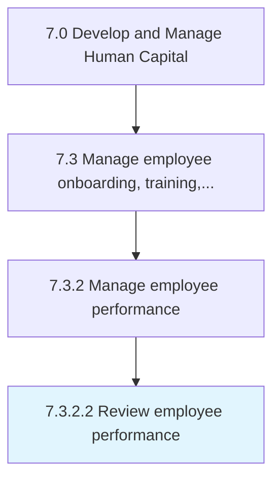
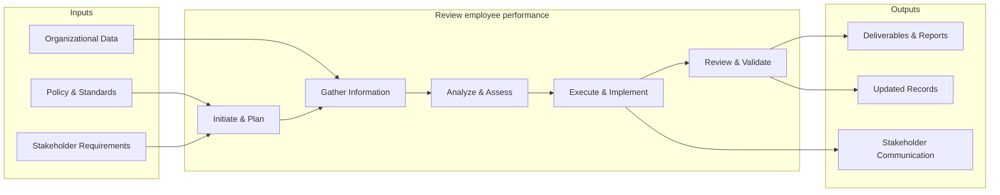

# Review employee performance

> Execution of employee reviews/performance on a frequent basis.

## Overview

Activity 7.3.2.2 is an activity within the Develop and Manage Human Capital framework. 

Execution of employee reviews/performance on a frequent basis.

This process provides systematic review and evaluation of employee performance. It includes performance assessment against established criteria, gap analysis, stakeholder feedback collection, and generation of recommendations for improvement and optimization.

## Process Hierarchy



## Key Statistics

| Metric | Value |
|--------|-------|
| APQC Code | 21434 |
| Hierarchy ID | 7.3.2.2 |
| Level | Activity |
| Parent | [7.3.2](../) |
| Sub-Processes | 0 |


## GraphDL Semantic Structure

```graphdl
review.EmployeePerformance
```

| Component | Value | Description |
|-----------|-------|-------------|
| Verb | `review` | Primary action |
| Object | `employee performance` | Direct object |


## Related Concepts

- EmployeePerformance


## Process Flow



## RACI Matrix

| Activity | Responsible | Accountable | Consulted | Informed |
|----------|------------|-------------|-----------|----------|
| Design training program | L&D Specialist | L&D Manager | Department Heads | HR Director |
| Conduct performance review | Manager | Department Head | HR Business Partner | Employee |
| Develop career plan | Employee | Manager | HR Business Partner | L&D Team |

## Related Occupations

- [Training and Development Managers](/occupations/Management/TrainingAndDevelopmentManagers)
- [Training and Development Specialists](/occupations/Business/TrainingAndDevelopmentSpecialists)
- [Human Resources Managers](/occupations/Management/HumanResourcesManagers)
- [Instructional Coordinators](/occupations/Education/InstructionalCoordinators)
- [Industrial-Organizational Psychologists](/occupations/Science/IndustrialOrganizationalPsychologists)

## Related Departments

- Human Resources
- Learning & Development
- Operations

## Industry Variations

### Healthcare

Requires mandatory continuing education (CME/CEU), clinical competency assessments, and compliance training for patient safety protocols.

### Financial Services

Emphasizes regulatory compliance training (SOX, AML, KYC), licensing requirements (Series 7, CFA), and ethics certification programs.

### Manufacturing

Focuses on safety certification (OSHA), equipment-specific training, lean/Six Sigma methodology, and apprenticeship programs.

## KPIs & Metrics

| Metric | Description | Target |
|--------|-------------|--------|
| Training Hours per Employee | Average annual training hours per employee | > 40 hours |
| Training Completion Rate | Percentage of assigned training completed on time | > 95% |
| Employee Performance Improvement | Percentage of employees improving performance ratings year-over-year | > 70% |
| Internal Promotion Rate | Percentage of open positions filled internally | > 30% |

---

*Source: APQC PCF 21434 (7.3.2.2) - APQC*
