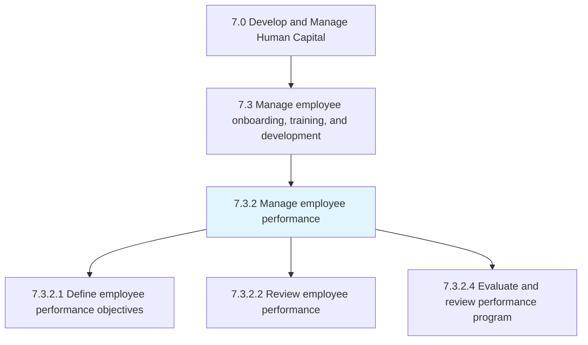
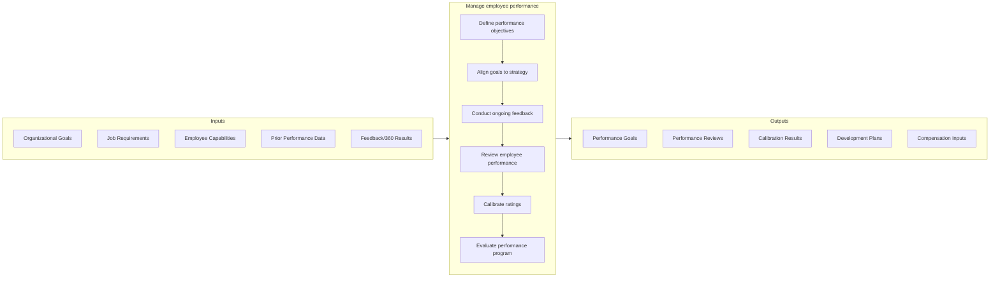

# Manage employee performance

> Defining individual performance objectives.

## Overview

Process 7.3.2 is a core process within [Manage Employee Onboarding, Training, and Development](../) that establishes the framework for setting expectations, measuring results, and driving continuous improvement in employee performance. This process connects individual contributions to organizational objectives through goal-setting, feedback, and performance evaluation.

Effective performance management goes beyond annual reviews to create an ongoing dialogue between managers and employees. Modern approaches emphasize continuous feedback, coaching conversations, development-focused discussions, and transparent goal alignment. The process must balance accountability for results with support for employee growth and engagement.

## Process Hierarchy



## Key Statistics

| Metric | Value |
|--------|-------|
| APQC Code | 10470 |
| Hierarchy ID | 7.3.2 |
| Level | Process |
| Parent | [7.3](../) |
| Sub-Processes | 3 |

## GraphDL Semantic Structure

```graphdl
manage.EmployeePerformance
```

| Component | Value | Description |
|-----------|-------|-------------|
| Verb | `manage` | Primary action of directing and overseeing |
| Object | `EmployeePerformance` | Individual work output and behaviors |

## Process Flow



## Sub-Processes

| Process | Hierarchy ID | Description |
|---------|-------------|-------------|
| [Define employee performance objectives](./DefineEmployeePerformanceObjectives) | 7.3.2.1 | Establishing SMART goals aligned to organizational objectives |
| [Review employee performance](./ReviewEmployeePerformance) | 7.3.2.2 | Conducting regular performance discussions and formal reviews |
| [Evaluate and review performance program](./EvaluateAndReviewPerformanceProgram) | 7.3.2.4 | Assessing program effectiveness and updating methodologies |

## RACI Matrix

| Activity | Responsible | Accountable | Consulted | Informed |
|----------|-------------|-------------|-----------|----------|
| Define performance framework | HR/Talent Management | CHRO | Leadership, Legal | All Managers |
| Set individual objectives | Manager & Employee | Manager | HR Business Partner | Skip Level |
| Conduct performance discussions | Manager | Manager | HR Business Partner | Employee |
| Complete formal reviews | Manager | Manager | HR | Compensation |
| Calibrate ratings | HR Business Partner | Business Leader | HR, Managers | Employees |
| Administer performance system | HR Operations | HR Director | IT | Managers |

## Key Stakeholders

- **Managers**: Set goals, provide feedback, conduct reviews
- **Employees**: Participate in goal-setting, seek feedback, self-assess
- **HR Business Partners**: Guide process, facilitate calibration
- **Leadership**: Define organizational priorities, review talent
- **Compensation Team**: Use ratings for pay decisions
- **Learning & Development**: Address performance gaps through training

## Metrics and KPIs

| Metric | Description | Target |
|--------|-------------|--------|
| Goal Completion Rate | Percentage of employees with documented goals | >95% |
| Review Completion Rate | On-time completion of formal reviews | >98% |
| Feedback Frequency | Check-ins per quarter manager/employee | >4 |
| Calibration Participation | Managers completing calibration sessions | 100% |
| Rating Distribution | Alignment to expected distribution curve | +/- 5% |
| Employee Satisfaction | Satisfaction with performance process | >70% |
| Manager Effectiveness | Manager coaching quality ratings | >4.0/5.0 |
| Goal-Strategy Alignment | Goals aligned to strategic objectives | >85% |

## Related Departments

- [Human Resources](/departments/HumanResources) - Process design and administration
- [Finance](/departments/Finance) - Compensation integration
- [All Departments](/departments) - Performance execution

## Related Occupations

- [Human Resources Managers](/occupations/Management/HumanResourcesManagers) - Process oversight
- [Training and Development Managers](/occupations/Management/TrainingDevelopmentManagers) - Development planning
- [Compensation and Benefits Managers](/occupations/Management/CompensationBenefitsManagers) - Pay-for-performance

## Related Concepts

- PerformanceManagement
- GoalSetting
- ContinuousFeedback
- PerformanceCalibration
- TalentReview
- EmployeeEngagement

---

*Source: APQC PCF 10470 (7.3.2) - APQC*
