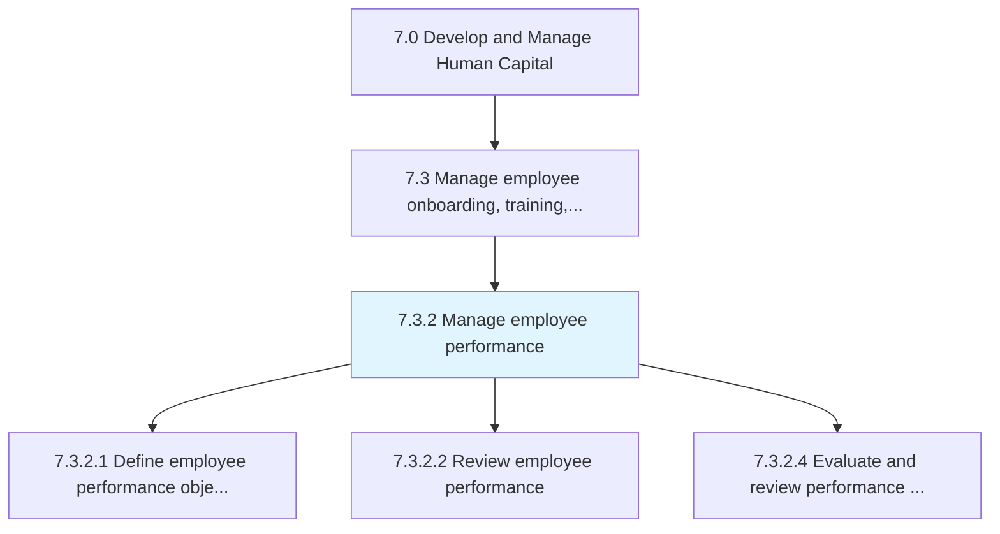
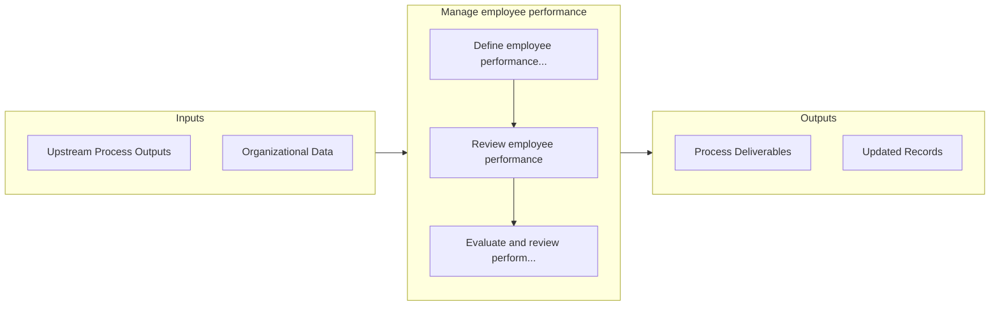

# Manage employee performance

> Defining individual performance objectives.

## Overview

Process 7.3.2 is a core process that defines the specific procedures for manage employee performance. 

Defining individual performance objectives. Review performance in order to provide appraisals. Evaluate the efficiency and effectiveness of the current performance program. Update it regularly.

## Process Hierarchy



## Key Statistics

| Metric | Value |
|--------|-------|
| APQC Code | 10470 |
| Hierarchy ID | 7.3.2 |
| Level | Process |
| Parent | [7.3](../) |
| Sub-Processes | 3 |


## GraphDL Semantic Structure

```
manage.EmployeePerformance
```

| Component | Value | Description |
|-----------|-------|-------------|
| Verb | `manage` | Primary action |
| Object | `employee performance` | Direct object |


## Process Flow



## Sub-Processes

| Process | Hierarchy ID | Description |
|---------|-------------|-------------|
| [Define employee performance objectives](./DefineEmployeePerformanceObjectives) | 7.3.2.1 | Outlining the objectives for employee performance |
| [Review employee performance](./ReviewEmployeePerformance) | 7.3.2.2 | Execution of employee reviews/performance on a frequent basis |
| [Evaluate and review performance program](./EvaluateAndReviewPerformanceProgram) | 7.3.2.4 | Assessing and revamping performance programs, including the instruments used to measure employee per |


## Related Concepts

- [EmployeePerformance](/concepts/EmployeePerformance)
- [EmployeePerformance](/concepts/EmployeePerformance)


---

*Source: APQC PCF 10470 (7.3.2) - APQC*
