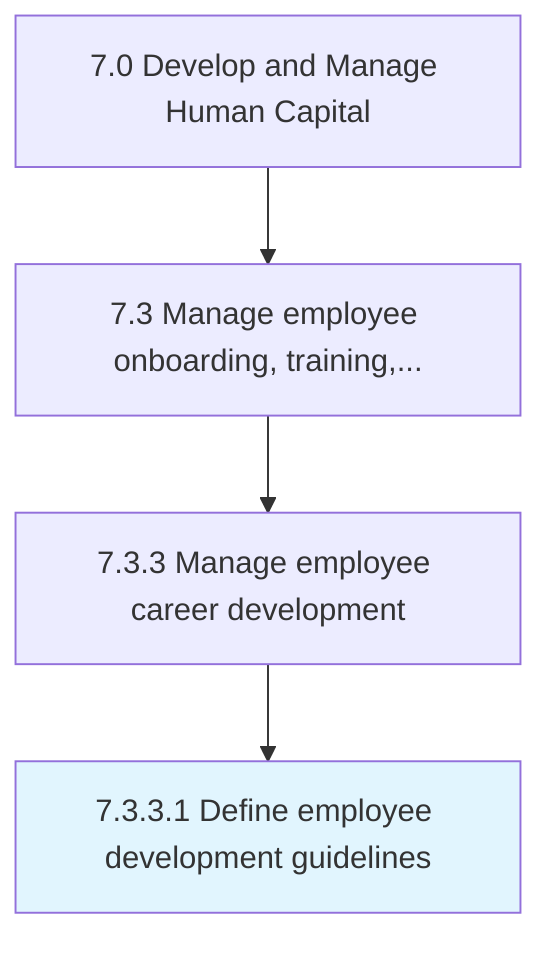

# Define employee development guidelines

> Outlining the guidelines for development of employees.

## Overview

Activity 7.3.3.1 is an activity within the Develop and Manage Human Capital framework. 

Outlining the guidelines for development of employees. Design development policies and procedures to identify areas of growth for employees, either in their current position or in preparation for future roles. Include topics related to knowledge and skill development.

## Process Hierarchy



## Key Statistics

| Metric | Value |
|--------|-------|
| APQC Code | 10487 |
| Hierarchy ID | 7.3.3.1 |
| Level | Activity |
| Parent | [7.3.3](../) |
| Sub-Processes | 0 |


## GraphDL Semantic Structure

```
define.EmployeeDevelopmentGuidelines
```

| Component | Value | Description |
|-----------|-------|-------------|
| Verb | `define` | Primary action |
| Object | `employee development guidelines` | Direct object |


## Related Concepts

- [EmployeeDevelopmentGuidelines](/concepts/EmployeeDevelopmentGuidelines)


---

*Source: APQC PCF 10487 (7.3.3.1) - APQC*
