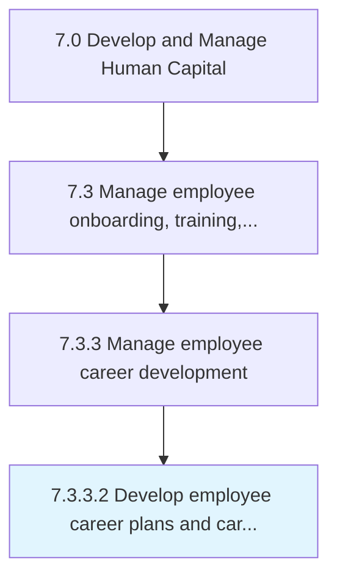

# Develop employee career plans and career paths

> Designing a future career path for the employees that encourages them to explore and gather information.

## Overview

Activity 7.3.3.2 is an activity within the Develop and Manage Human Capital framework. 

Designing a future career path for the employees that encourages them to explore and gather information.

## Process Hierarchy



## Key Statistics

| Metric | Value |
|--------|-------|
| APQC Code | 10488 |
| Hierarchy ID | 7.3.3.2 |
| Level | Activity |
| Parent | [7.3.3](../) |
| Sub-Processes | 0 |


## GraphDL Semantic Structure

```
develop.EmployeeCareerPlansAndCareerPaths
```

| Component | Value | Description |
|-----------|-------|-------------|
| Verb | `develop` | Primary action |
| Object | `employee career plans and career paths` | Direct object |


## Related Concepts

- EmployeeCareerPlansPaths
- CareerPaths


---

*Source: APQC PCF 10488 (7.3.3.2) - APQC*
