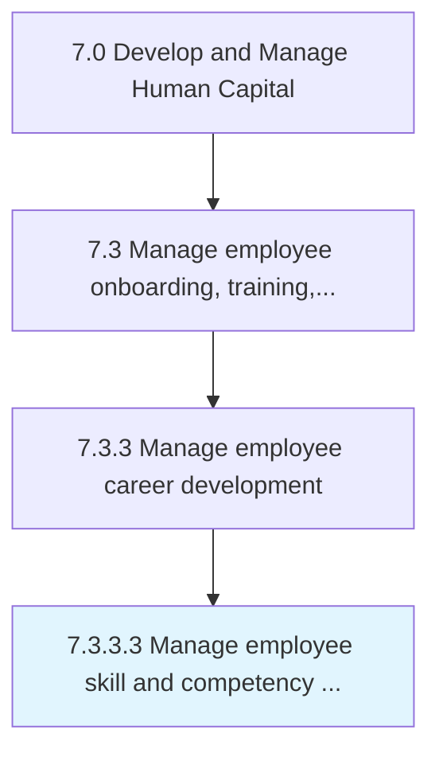
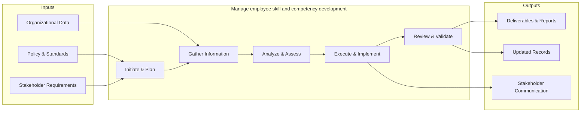
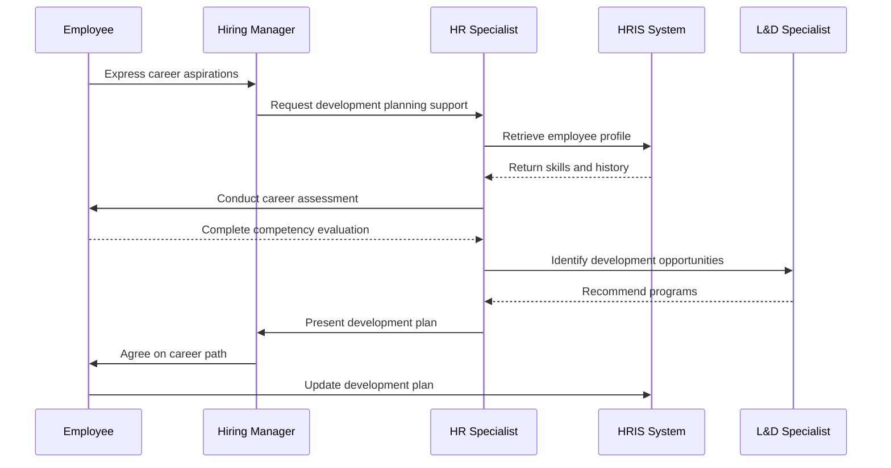

# Manage employee skill and competency development

> Administering the development of employee skills.

## Overview

Activity 7.3.3.3 is an activity within the Develop and Manage Human Capital framework. 

Administering the development of employee skills. Conduct training, coaching and mentoring, job-rotation and cross training, lateral moves, etc.

This process provides a structured approach to managing employee skill and competency development across the organization. It includes establishing governance frameworks, defining operational procedures, monitoring performance, ensuring compliance with policies and regulations, and driving continuous improvement through data-driven insights.

## Process Hierarchy



## Key Statistics

| Metric | Value |
|--------|-------|
| APQC Code | 17051 |
| Hierarchy ID | 7.3.3.3 |
| Level | Activity |
| Parent | [7.3.3](../) |
| Sub-Processes | 0 |


## GraphDL Semantic Structure

```graphdl
manage.EmployeeSkillAndCompetencyDevelopment
```

| Component | Value | Description |
|-----------|-------|-------------|
| Verb | `manage` | Primary action |
| Object | `employee skill and competency development` | Direct object |


## Related Concepts

- EmployeeSkill
- CompetencyDevelopment


## Process Flow



## Process Sequence



## RACI Matrix

| Activity | Responsible | Accountable | Consulted | Informed |
|----------|------------|-------------|-----------|----------|
| Design training program | L&D Specialist | L&D Manager | Department Heads | HR Director |
| Conduct performance review | Manager | Department Head | HR Business Partner | Employee |
| Develop career plan | Employee | Manager | HR Business Partner | L&D Team |

## Related Occupations

- [Training and Development Managers](/occupations/Management/TrainingAndDevelopmentManagers)
- [Training and Development Specialists](/occupations/Business/TrainingAndDevelopmentSpecialists)
- [Human Resources Managers](/occupations/Management/HumanResourcesManagers)
- [Instructional Coordinators](/occupations/Education/InstructionalCoordinators)
- [Industrial-Organizational Psychologists](/occupations/Science/IndustrialOrganizationalPsychologists)

## Related Departments

- Human Resources
- Learning & Development
- Operations

## Industry Variations

### Healthcare

Requires mandatory continuing education (CME/CEU), clinical competency assessments, and compliance training for patient safety protocols.

### Financial Services

Emphasizes regulatory compliance training (SOX, AML, KYC), licensing requirements (Series 7, CFA), and ethics certification programs.

### Manufacturing

Focuses on safety certification (OSHA), equipment-specific training, lean/Six Sigma methodology, and apprenticeship programs.

## KPIs & Metrics

| Metric | Description | Target |
|--------|-------------|--------|
| Training Hours per Employee | Average annual training hours per employee | > 40 hours |
| Training Completion Rate | Percentage of assigned training completed on time | > 95% |
| Employee Performance Improvement | Percentage of employees improving performance ratings year-over-year | > 70% |
| Internal Promotion Rate | Percentage of open positions filled internally | > 30% |

---

*Source: APQC PCF 17051 (7.3.3.3) - APQC*
