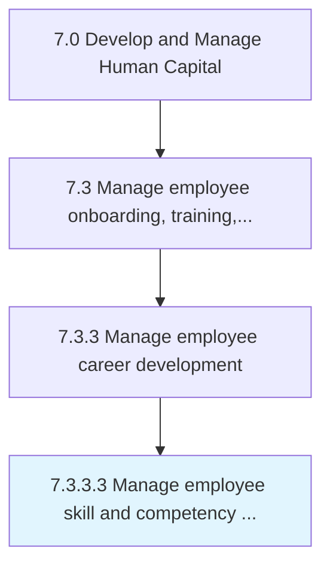

# Manage employee skill and competency development

> Administering the development of employee skills.

## Overview

Activity 7.3.3.3 is an activity within the Develop and Manage Human Capital framework. 

Administering the development of employee skills. Conduct training, coaching and mentoring, job-rotation and cross training, lateral moves, etc.

## Process Hierarchy



## Key Statistics

| Metric | Value |
|--------|-------|
| APQC Code | 17051 |
| Hierarchy ID | 7.3.3.3 |
| Level | Activity |
| Parent | [7.3.3](../) |
| Sub-Processes | 0 |


## GraphDL Semantic Structure

```
manage.EmployeeSkillAndCompetencyDevelopment
```

| Component | Value | Description |
|-----------|-------|-------------|
| Verb | `manage` | Primary action |
| Object | `employee skill and competency development` | Direct object |


## Related Concepts

- EmployeeSkill
- CompetencyDevelopment


---

*Source: APQC PCF 17051 (7.3.3.3) - APQC*
