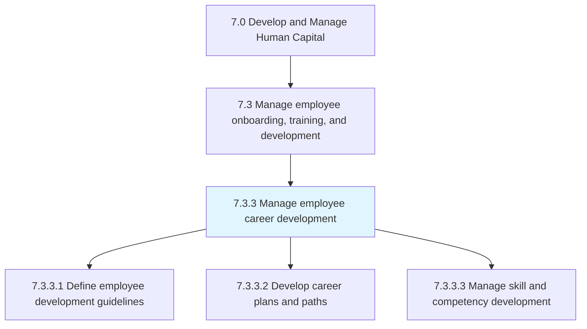
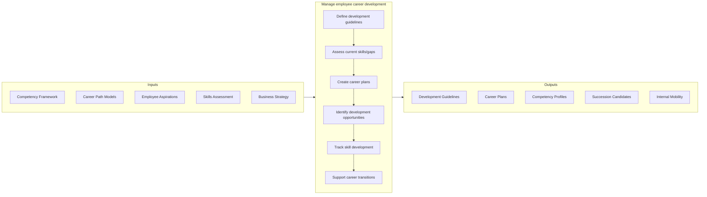

# Manage employee career development

> Establishing employee development guidelines.

## Overview

Process 7.3.3 is a core process within [Manage Employee Onboarding, Training, and Development](../) that provides the framework for employees to grow their careers within the organization. This process establishes clear career paths, defines competency requirements, and enables systematic skill development aligned with both individual aspirations and organizational needs.

Effective career development creates a partnership between employees, managers, and the organization. It includes transparent career paths, competency frameworks, individual development planning, mentoring programs, stretch assignments, and internal mobility opportunities. When implemented well, career development improves engagement, reduces turnover, builds internal talent pipelines, and ensures the organization has capabilities needed for future success.

## Process Hierarchy



## Key Statistics

| Metric | Value |
|--------|-------|
| APQC Code | 10472 |
| Hierarchy ID | 7.3.3 |
| Level | Process |
| Parent | [7.3](../) |
| Sub-Processes | 3 |

## GraphDL Semantic Structure

```graphdl
manage.CareerDevelopment.for.Employees
```

| Component | Value | Description |
|-----------|-------|-------------|
| Verb | `manage` | Primary action of directing growth |
| Object | `CareerDevelopment` | Progression and skill building |
| Preposition | `for` | Beneficiary relationship |
| PrepObject | `Employees` | Workforce members |

## Process Flow



## Sub-Processes

| Process | Hierarchy ID | Description |
|---------|-------------|-------------|
| [Define employee development guidelines](./DefineEmployeeDevelopmentGuidelines) | 7.3.3.1 | Establishing organizational standards for development activities |
| [Develop employee career plans and paths](./DevelopEmployeeCareerPlansAndCareerPaths) | 7.3.3.2 | Creating visible career progression routes and individual plans |
| [Manage employee skill and competency development](./ManageEmployeeSkillAndCompetencyDevelopment) | 7.3.3.3 | Tracking and advancing individual skill growth |

## RACI Matrix

| Activity | Responsible | Accountable | Consulted | Informed |
|----------|-------------|-------------|-----------|----------|
| Define competency framework | Talent Management | CHRO | Business Leaders | All Employees |
| Create career paths | HR/Talent Team | HR Director | Job Families | Employees |
| Conduct career discussions | Manager | Manager | HR Business Partner | Employee |
| Develop individual plans | Employee & Manager | Manager | Talent Management | HR |
| Identify development actions | Employee | Manager | L&D | HR Business Partner |
| Track skill development | HR Operations | Talent Management | Managers | Leadership |

## Key Stakeholders

- **Talent Management Team**: Designs career frameworks and programs
- **Managers**: Conducts career conversations, supports development
- **Employees**: Owns career growth, pursues development
- **HR Business Partners**: Advises on career opportunities
- **Learning & Development**: Provides development resources
- **Leadership**: Models career development, sponsors talent

## Metrics and KPIs

| Metric | Description | Target |
|--------|-------------|--------|
| Career Plan Coverage | Employees with documented career plans | >70% |
| Internal Fill Rate | Positions filled by internal candidates | >30% |
| Competency Progress | Employees advancing competency levels | >40% annually |
| Development Goal Completion | Career development goals achieved | >75% |
| Career Conversation Frequency | Career discussions per year | >2 |
| Internal Mobility Rate | Employees moving to new roles | >15% |
| Retention of Developed Talent | Retention of high-development employees | >90% |
| Career Satisfaction | Employee satisfaction with career support | >75% |

## Related Departments

- [Human Resources](/departments/HumanResources) - Career framework ownership
- [Learning & Development](/departments/HumanResources/LearningDevelopment) - Development delivery
- [All Departments](/departments) - Career path definition and execution

## Related Occupations

- [Training and Development Managers](/occupations/Management/TrainingDevelopmentManagers) - Program design
- [Human Resources Managers](/occupations/Management/HumanResourcesManagers) - Career framework oversight
- [Human Resources Specialists](/occupations/Business/HumanResourcesSpecialists) - Career coaching

## Related Concepts

- CareerPathing
- CompetencyManagement
- TalentDevelopment
- SuccessionPlanning
- InternalMobility
- MentoringPrograms
- SkillsFramework

---

*Source: APQC PCF 10472 (7.3.3) - APQC*
