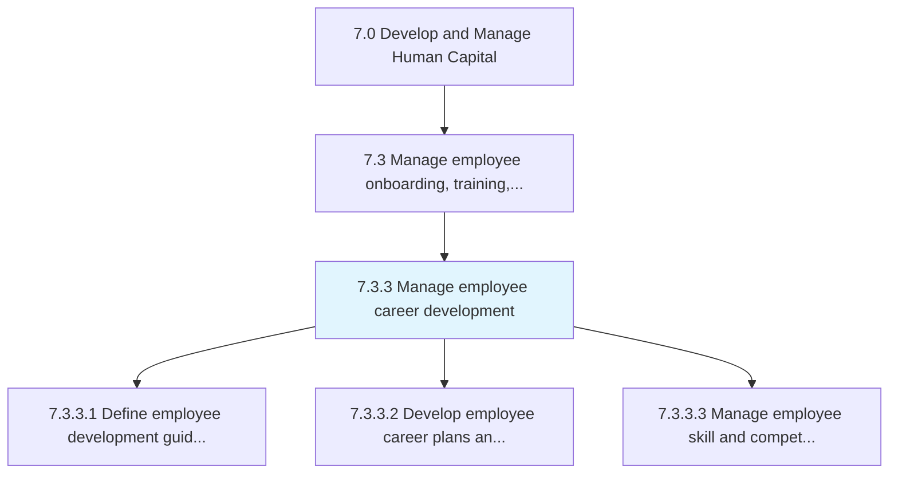
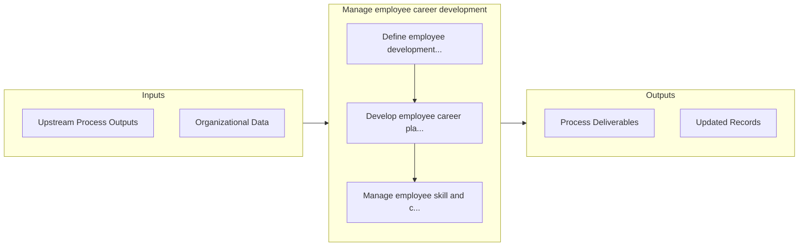

# Manage employee career development

> Establishing employee development guidelines.

## Overview

Process 7.3.3 is a core process that defines the specific procedures for manage employee career development. 

Establishing employee development guidelines. Lay out career paths and plans for them. Manage the development of their skills to enhance their skills, ability, and knowledge.

## Process Hierarchy



## Key Statistics

| Metric | Value |
|--------|-------|
| APQC Code | 10472 |
| Hierarchy ID | 7.3.3 |
| Level | Process |
| Parent | [7.3](../) |
| Sub-Processes | 3 |


## GraphDL Semantic Structure

```graphdl
manage.EmployeeCareerDevelopment
```

| Component | Value | Description |
|-----------|-------|-------------|
| Verb | `manage` | Primary action |
| Object | `employee career development` | Direct object |


## Process Flow



## Sub-Processes

| Process | Hierarchy ID | Description |
|---------|-------------|-------------|
| [Define employee development guidelines](./DefineEmployeeDevelopmentGuidelines) | 7.3.3.1 | Outlining the guidelines for development of employees |
| [Develop employee career plans and career paths](./DevelopEmployeeCareerPlansAndCareerPaths) | 7.3.3.2 | Designing a future career path for the employees that encourages them to explore and gather informat |
| [Manage employee skill and competency development](./ManageEmployeeSkillAndCompetencyDevelopment) | 7.3.3.3 | Administering the development of employee skills |


## Related Concepts

- EmployeeCareerDevelopment


---

*Source: APQC PCF 10472 (7.3.3) - APQC*
