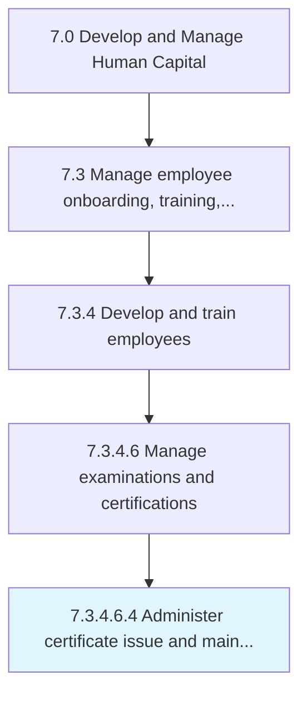

# Administer certificate issue and maintenance

> Administering certificates to all candidates that have successfully met experience qualifications, and passed all tests necessary to obtain the certificate.

## Overview

Sub-Activity 7.3.4.6.4 is an activity within the Develop and Manage Human Capital framework. 

Administering certificates to all candidates that have successfully met experience qualifications, and passed all tests necessary to obtain the certificate.

## Process Hierarchy



## Key Statistics

| Metric | Value |
|--------|-------|
| APQC Code | 20129 |
| Hierarchy ID | 7.3.4.6.4 |
| Level | Sub-Activity |
| Parent | [7.3.4.6](../) |
| Sub-Processes | 0 |


## GraphDL Semantic Structure

```
administer.CertificateIssueAndMaintenance
```

| Component | Value | Description |
|-----------|-------|-------------|
| Verb | `administer` | Primary action |
| Object | `certificate issue and maintenance` | Direct object |


## Related Concepts

- [CertificateIssue](/concepts/CertificateIssue)
- [Maintenance](/concepts/Maintenance)


---

*Source: APQC PCF 20129 (7.3.4.6.4) - APQC*
