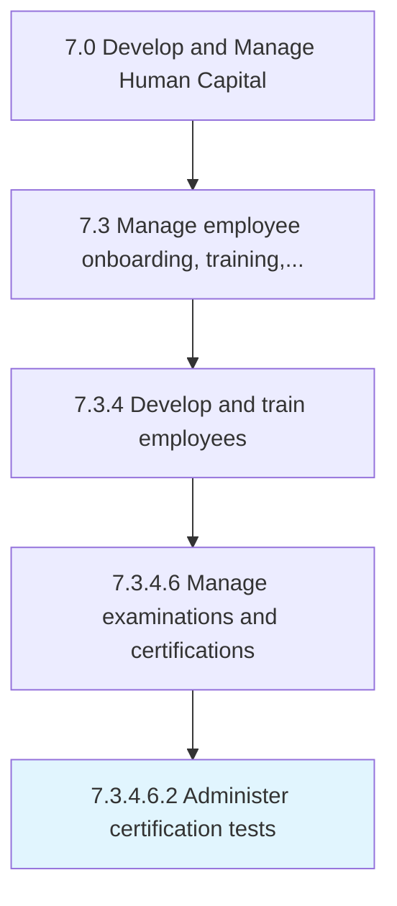

# Administer certification tests

> Providing tests to the workforce that will satisfy completion of certifications.

## Overview

Sub-Activity 7.3.4.6.2 is an activity within the Develop and Manage Human Capital framework. 

Providing tests to the workforce that will satisfy completion of certifications.

## Process Hierarchy



## Key Statistics

| Metric | Value |
|--------|-------|
| APQC Code | 20127 |
| Hierarchy ID | 7.3.4.6.2 |
| Level | Sub-Activity |
| Parent | [7.3.4.6](../) |
| Sub-Processes | 0 |


## GraphDL Semantic Structure

```
administer.CertificationTests
```

| Component | Value | Description |
|-----------|-------|-------------|
| Verb | `administer` | Primary action |
| Object | `certification tests` | Direct object |


## Related Concepts

- [CertificationTests](/concepts/CertificationTests)


---

*Source: APQC PCF 20127 (7.3.4.6.2) - APQC*
