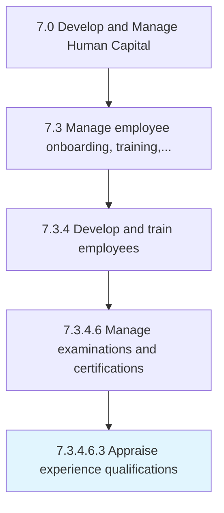

# Appraise experience qualifications

> Ascertaining the experience level needed to qualify for a specific job or certification within the organization.

## Overview

Sub-Activity 7.3.4.6.3 is an activity within the Develop and Manage Human Capital framework. 

Ascertaining the experience level needed to qualify for a specific job or certification within the organization. Some certificates require practical experience as well as training programs.

## Process Hierarchy



## Key Statistics

| Metric | Value |
|--------|-------|
| APQC Code | 20128 |
| Hierarchy ID | 7.3.4.6.3 |
| Level | Sub-Activity |
| Parent | [7.3.4.6](../) |
| Sub-Processes | 0 |


## GraphDL Semantic Structure

```
appraise.ExperienceQualifications
```

| Component | Value | Description |
|-----------|-------|-------------|
| Verb | `appraise` | Primary action |
| Object | `experience qualifications` | Direct object |


## Related Concepts

- [ExperienceQualifications](/concepts/ExperienceQualifications)


---

*Source: APQC PCF 20128 (7.3.4.6.3) - APQC*
