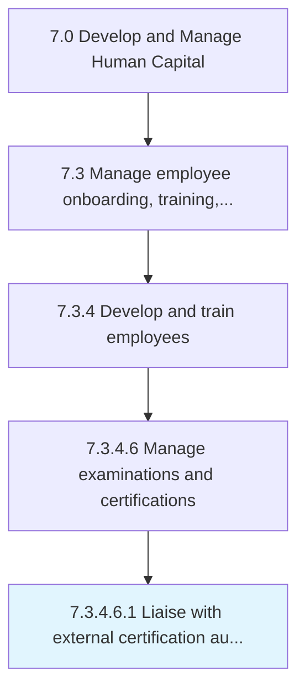
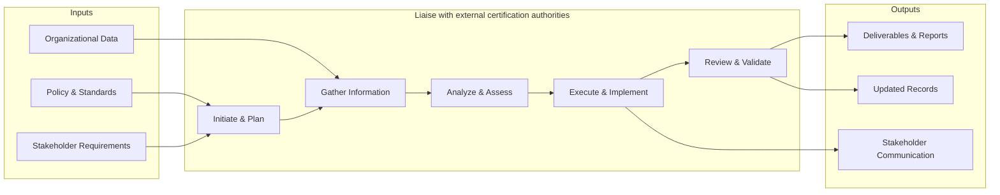

# Liaise with external certification authorities

> Coordinating with third party certification authorities to provide training and certifications for necessary skills.

## Overview

Sub-Activity 7.3.4.6.1 is an activity within the Develop and Manage Human Capital framework. 

Coordinating with third party certification authorities to provide training and certifications for necessary skills.

This process manages liaison activities with with external certification authorities. It involves establishing communication channels, coordinating information exchange, facilitating collaboration, resolving issues, and maintaining productive working relationships.

## Process Hierarchy



## Key Statistics

| Metric | Value |
|--------|-------|
| APQC Code | 20126 |
| Hierarchy ID | 7.3.4.6.1 |
| Level | Sub-Activity |
| Parent | [7.3.4.6](../) |
| Sub-Processes | 0 |


## GraphDL Semantic Structure

```
liaise.WithExternalCertificationAuthorities
```

| Component | Value | Description |
|-----------|-------|-------------|
| Verb | `liaise` | Primary action |
| Object | `with external certification authorities` | Direct object |


## Related Concepts

- ExternalCertificationAuthorities


## Process Flow



## RACI Matrix

| Activity | Responsible | Accountable | Consulted | Informed |
|----------|------------|-------------|-----------|----------|
| Design training program | L&D Specialist | L&D Manager | Department Heads | HR Director |
| Conduct performance review | Manager | Department Head | HR Business Partner | Employee |
| Develop career plan | Employee | Manager | HR Business Partner | L&D Team |

## Related Occupations

- [Training and Development Managers](/occupations/TrainingAndDevelopmentManagers)
- [Training and Development Specialists](/occupations/TrainingAndDevelopmentSpecialists)
- [Human Resources Managers](/occupations/HumanResourcesManagers)
- [Instructional Coordinators](/occupations/InstructionalCoordinators)
- [Industrial-Organizational Psychologists](/occupations/IndustrialOrganizationalPsychologists)

## Related Departments

- Human Resources
- Learning & Development
- Operations

## Industry Variations

### Healthcare

Requires mandatory continuing education (CME/CEU), clinical competency assessments, and compliance training for patient safety protocols.

### Financial Services

Emphasizes regulatory compliance training (SOX, AML, KYC), licensing requirements (Series 7, CFA), and ethics certification programs.

### Manufacturing

Focuses on safety certification (OSHA), equipment-specific training, lean/Six Sigma methodology, and apprenticeship programs.

## KPIs & Metrics

| Metric | Description | Target |
|--------|-------------|--------|
| Training Hours per Employee | Average annual training hours per employee | > 40 hours |
| Training Completion Rate | Percentage of assigned training completed on time | > 95% |
| Employee Performance Improvement | Percentage of employees improving performance ratings year-over-year | > 70% |
| Internal Promotion Rate | Percentage of open positions filled internally | > 30% |

---

*Source: APQC PCF 20126 (7.3.4.6.1) - APQC*
