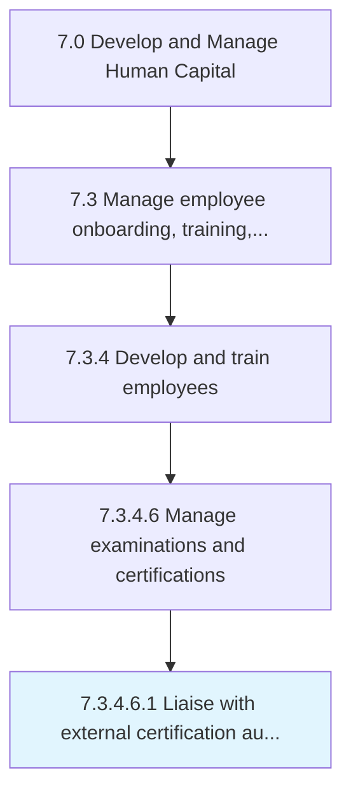

# Liaise with external certification authorities

> Coordinating with third party certification authorities to provide training and certifications for necessary skills.

## Overview

Sub-Activity 7.3.4.6.1 is an activity within the Develop and Manage Human Capital framework. 

Coordinating with third party certification authorities to provide training and certifications for necessary skills.

## Process Hierarchy



## Key Statistics

| Metric | Value |
|--------|-------|
| APQC Code | 20126 |
| Hierarchy ID | 7.3.4.6.1 |
| Level | Sub-Activity |
| Parent | [7.3.4.6](../) |
| Sub-Processes | 0 |


## GraphDL Semantic Structure

```
liaise.WithExternalCertificationAuthorities
```

| Component | Value | Description |
|-----------|-------|-------------|
| Verb | `liaise` | Primary action |
| Object | `with external certification authorities` | Direct object |


## Related Concepts

- ExternalCertificationAuthorities


---

*Source: APQC PCF 20126 (7.3.4.6.1) - APQC*
