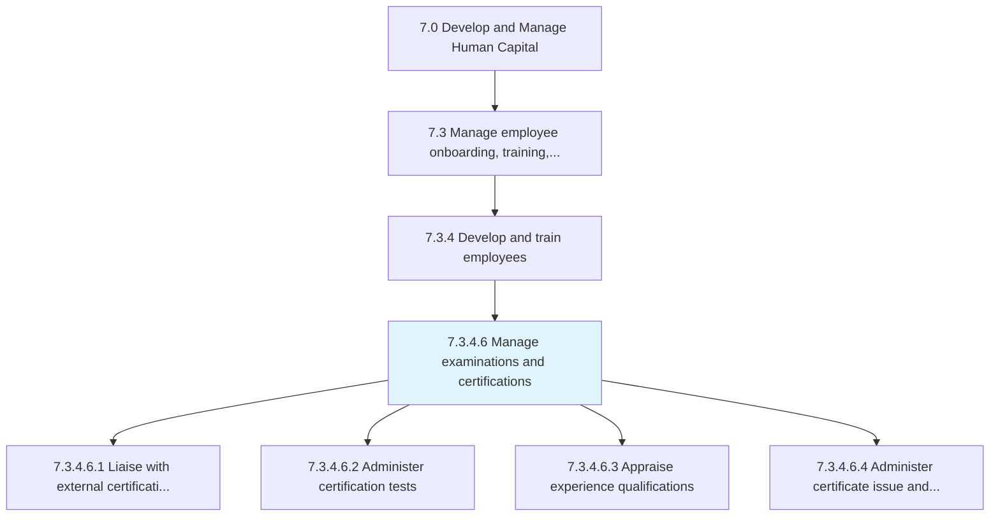
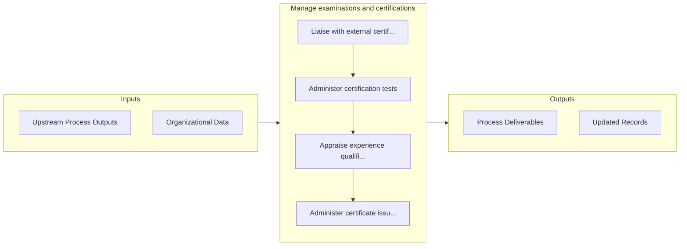

# Manage examinations and certifications

> Managing identified training programs for employees.

## Overview

Activity 7.3.4.6 is an activity within the Develop and Manage Human Capital framework. 

Managing identified training programs for employees. Engage with industries to provide certifications, administer certification test, and maintain active certification.

## Process Hierarchy



## Key Statistics

| Metric | Value |
|--------|-------|
| APQC Code | 20125 |
| Hierarchy ID | 7.3.4.6 |
| Level | Activity |
| Parent | [7.3.4](../) |
| Sub-Processes | 4 |


## GraphDL Semantic Structure

```graphdl
manage.ExaminationsAndCertifications
```

| Component | Value | Description |
|-----------|-------|-------------|
| Verb | `manage` | Primary action |
| Object | `examinations and certifications` | Direct object |


## Process Flow



## Sub-Processes

| Process | Hierarchy ID | Description |
|---------|-------------|-------------|
| [Liaise with external certification authorities](./LiaiseWithExternalCertificationAuthorities) | 7.3.4.6.1 | Coordinating with third party certification authorities to provide training and certifications for n |
| [Administer certification tests](./AdministerCertificationTests) | 7.3.4.6.2 | Providing tests to the workforce that will satisfy completion of certifications |
| [Appraise experience qualifications](./AppraiseExperienceQualifications) | 7.3.4.6.3 | Ascertaining the experience level needed to qualify for a specific job or certification within the o |
| [Administer certificate issue and maintenance](./AdministerCertificateIssueAndMaintenance) | 7.3.4.6.4 | Administering certificates to all candidates that have successfully met experience qualifications, a |


## Related Concepts

- Examinations
- Certifications


---

*Source: APQC PCF 20125 (7.3.4.6) - APQC*
