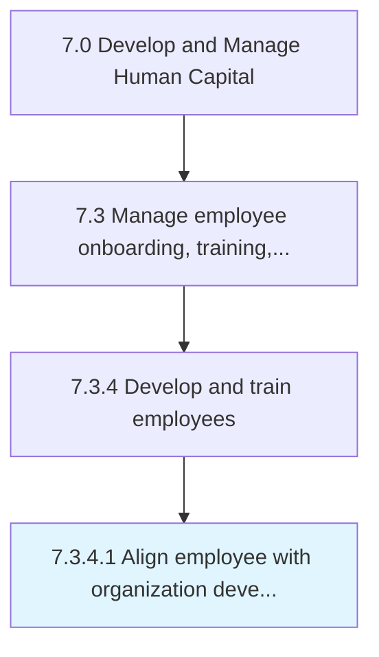

# Align employee with organization development needs

> Aligning the needs of the employees to development needs.

## Overview

Activity 7.3.4.1 is an activity within the Develop and Manage Human Capital framework. 

Aligning the needs of the employees to development needs.

## Process Hierarchy



## Key Statistics

| Metric | Value |
|--------|-------|
| APQC Code | 10490 |
| Hierarchy ID | 7.3.4.1 |
| Level | Activity |
| Parent | [7.3.4](../) |
| Sub-Processes | 0 |


## GraphDL Semantic Structure

```
align.Employee.with.OrganizationDevelopmentNeeds
```

| Component | Value | Description |
|-----------|-------|-------------|
| Verb | `align` | Primary action |
| Object | `employee` | Direct object |
| Preposition | `with` | Relationship |
| PrepObject | `organization development needs` | Indirect object |


## Related Concepts

- [Employee](/concepts/Employee)
- [OrganizationDevelopmentNeeds](/concepts/OrganizationDevelopmentNeeds)


---

*Source: APQC PCF 10490 (7.3.4.1) - APQC*
