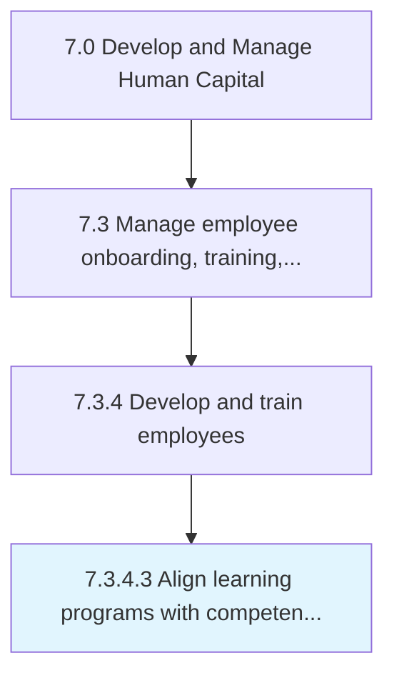
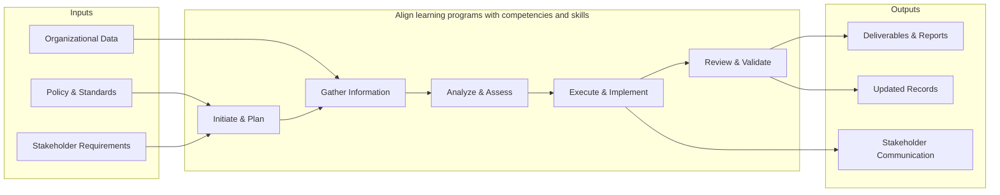

# Align learning programs with competencies and skills

> Aligning the learning programs with the core capabilities and competencies of the organization.

## Overview

Activity 7.3.4.3 is an activity within the Develop and Manage Human Capital framework. 

Aligning the learning programs with the core capabilities and competencies of the organization. Contextualize the training programs so that employees can expand their knowledge base and add new skills in line with the core competencies of the organization.

This process ensures strategic alignment of learning programs.with. competencies and skills with broader organizational objectives. It involves gap analysis, strategy mapping, cross-functional coordination, and continuous monitoring to maintain alignment as business priorities evolve.

## Process Hierarchy



## Key Statistics

| Metric | Value |
|--------|-------|
| APQC Code | 10491 |
| Hierarchy ID | 7.3.4.3 |
| Level | Activity |
| Parent | [7.3.4](../) |
| Sub-Processes | 0 |


## GraphDL Semantic Structure

```
align.LearningPrograms.with.CompetenciesAndSkills
```

| Component | Value | Description |
|-----------|-------|-------------|
| Verb | `align` | Primary action |
| Object | `learning programs` | Direct object |
| Preposition | `with` | Relationship |
| PrepObject | `competencies and skills` | Indirect object |


## Related Concepts

- LearningPrograms
- Competencies
- LearningPrograms
- Skills


## Process Flow



## RACI Matrix

| Activity | Responsible | Accountable | Consulted | Informed |
|----------|------------|-------------|-----------|----------|
| Design training program | L&D Specialist | L&D Manager | Department Heads | HR Director |
| Conduct performance review | Manager | Department Head | HR Business Partner | Employee |
| Develop career plan | Employee | Manager | HR Business Partner | L&D Team |

## Related Occupations

- [Training and Development Managers](/occupations/TrainingAndDevelopmentManagers)
- [Training and Development Specialists](/occupations/TrainingAndDevelopmentSpecialists)
- [Human Resources Managers](/occupations/HumanResourcesManagers)
- [Instructional Coordinators](/occupations/InstructionalCoordinators)
- [Industrial-Organizational Psychologists](/occupations/IndustrialOrganizationalPsychologists)

## Related Departments

- Human Resources
- Learning & Development
- Operations

## Industry Variations

### Healthcare

Requires mandatory continuing education (CME/CEU), clinical competency assessments, and compliance training for patient safety protocols.

### Financial Services

Emphasizes regulatory compliance training (SOX, AML, KYC), licensing requirements (Series 7, CFA), and ethics certification programs.

### Manufacturing

Focuses on safety certification (OSHA), equipment-specific training, lean/Six Sigma methodology, and apprenticeship programs.

## KPIs & Metrics

| Metric | Description | Target |
|--------|-------------|--------|
| Training Hours per Employee | Average annual training hours per employee | > 40 hours |
| Training Completion Rate | Percentage of assigned training completed on time | > 95% |
| Employee Performance Improvement | Percentage of employees improving performance ratings year-over-year | > 70% |
| Internal Promotion Rate | Percentage of open positions filled internally | > 30% |

---

*Source: APQC PCF 10491 (7.3.4.3) - APQC*
