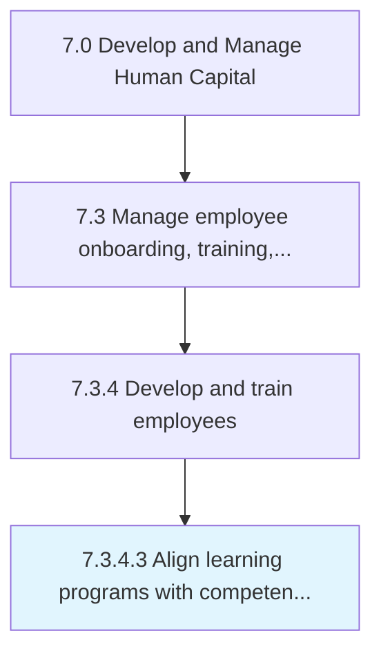

# Align learning programs with competencies and skills

> Aligning the learning programs with the core capabilities and competencies of the organization.

## Overview

Activity 7.3.4.3 is an activity within the Develop and Manage Human Capital framework. 

Aligning the learning programs with the core capabilities and competencies of the organization. Contextualize the training programs so that employees can expand their knowledge base and add new skills in line with the core competencies of the organization.

## Process Hierarchy



## Key Statistics

| Metric | Value |
|--------|-------|
| APQC Code | 10491 |
| Hierarchy ID | 7.3.4.3 |
| Level | Activity |
| Parent | [7.3.4](../) |
| Sub-Processes | 0 |


## GraphDL Semantic Structure

```
align.LearningPrograms.with.CompetenciesAndSkills
```

| Component | Value | Description |
|-----------|-------|-------------|
| Verb | `align` | Primary action |
| Object | `learning programs` | Direct object |
| Preposition | `with` | Relationship |
| PrepObject | `competencies and skills` | Indirect object |


## Related Concepts

- LearningPrograms
- Competencies
- LearningPrograms
- Skills


---

*Source: APQC PCF 10491 (7.3.4.3) - APQC*
