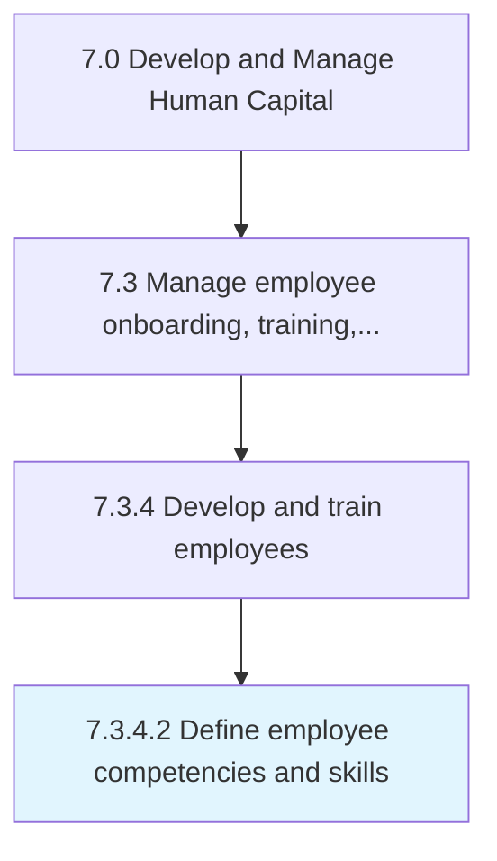

# Define employee competencies and skills

> Defining the skills, knowledge, abilities, and attributes needed to carry out a specific job.

## Overview

Activity 7.3.4.2 is an activity within the Develop and Manage Human Capital framework. 

Defining the skills, knowledge, abilities, and attributes needed to carry out a specific job.

## Process Hierarchy



## Key Statistics

| Metric | Value |
|--------|-------|
| APQC Code | 16940 |
| Hierarchy ID | 7.3.4.2 |
| Level | Activity |
| Parent | [7.3.4](../) |
| Sub-Processes | 0 |


## GraphDL Semantic Structure

```
define.EmployeeCompetenciesAndSkills
```

| Component | Value | Description |
|-----------|-------|-------------|
| Verb | `define` | Primary action |
| Object | `employee competencies and skills` | Direct object |


## Related Concepts

- [EmployeeCompetencies](/concepts/EmployeeCompetencies)
- [Skills](/concepts/Skills)


---

*Source: APQC PCF 16940 (7.3.4.2) - APQC*
