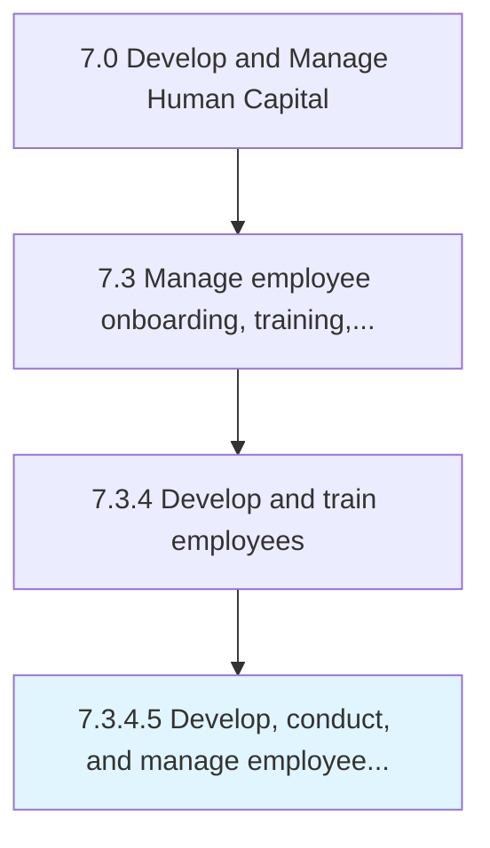

# Develop, conduct, and manage employee and/or management training programs

> Creating, implementing, and managing the programs for training employees.

## Overview

Activity 7.3.4.5 is an activity within the Develop and Manage Human Capital framework. 

Creating, implementing, and managing the programs for training employees. Create and design sessions on the basis of the needs and the availability of the skills. Conduct the sessions on the ground. Manage all aspects related to the training programs. Consider including literacy training, interpersonal skills training, technical training, problem-solving training, diversity or sensitivity training, etc.

## Process Hierarchy



## Key Statistics

| Metric | Value |
|--------|-------|
| APQC Code | 10493 |
| Hierarchy ID | 7.3.4.5 |
| Level | Activity |
| Parent | [7.3.4](../) |
| Sub-Processes | 0 |


## GraphDL Semantic Structure

```
develop,.ConductAndManageEmployeeAndorManagementTrainingPrograms
```

| Component | Value | Description |
|-----------|-------|-------------|
| Verb | `develop,` | Primary action |
| Object | `conduct, and manage employee and/or management training programs` | Direct object |


## Related Concepts

- [Employee/ManagementTrainingPrograms](/concepts/Employee/ManagementTrainingPrograms)
- [Employee/ManagementTrainingPrograms](/concepts/Employee/ManagementTrainingPrograms)
- [Employee/ManagementTrainingPrograms](/concepts/Employee/ManagementTrainingPrograms)


---

*Source: APQC PCF 10493 (7.3.4.5) - APQC*
