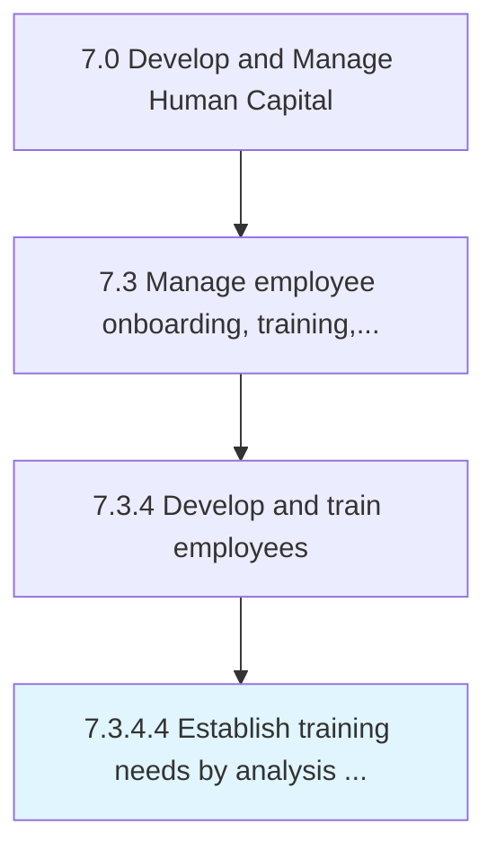
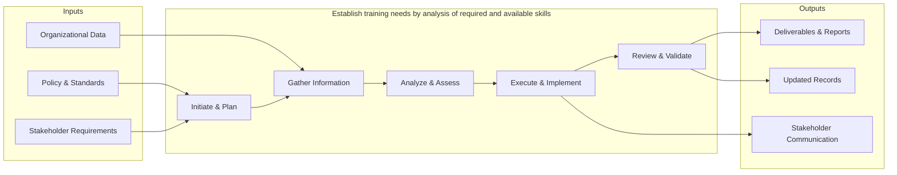

# Establish training needs by analysis of required and available skills

> Determining the training necessitated by business processes, using an examination of skill sets that are needed by the organization and those already possessed.

## Overview

Activity 7.3.4.4 is an activity within the Develop and Manage Human Capital framework. 

Determining the training necessitated by business processes, using an examination of skill sets that are needed by the organization and those already possessed. Examine the various skills required by individual employees. Design training in light of the availability of resources to provide specific segments of training.

This process creates and establishes robust frameworks for training needs.by. analysis of required and available skills. It involves defining standards, setting benchmarks, documenting procedures, obtaining stakeholder buy-in, and implementing governance structures to ensure long-term sustainability and effectiveness.

## Process Hierarchy



## Key Statistics

| Metric | Value |
|--------|-------|
| APQC Code | 10492 |
| Hierarchy ID | 7.3.4.4 |
| Level | Activity |
| Parent | [7.3.4](../) |
| Sub-Processes | 0 |


## GraphDL Semantic Structure

```graphdl
establish.TrainingNeeds.by.AnalysisOfRequiredAndAvailableSkills
```

| Component | Value | Description |
|-----------|-------|-------------|
| Verb | `establish` | Primary action |
| Object | `training needs` | Direct object |
| Preposition | `by` | Relationship |
| PrepObject | `analysis of required and available skills` | Indirect object |


## Related Concepts

- TrainingNeeds
- AnalysisOfRequiredSkills
- TrainingNeeds
- AvailableSkills


## Process Flow



## RACI Matrix

| Activity | Responsible | Accountable | Consulted | Informed |
|----------|------------|-------------|-----------|----------|
| Design training program | L&D Specialist | L&D Manager | Department Heads | HR Director |
| Conduct performance review | Manager | Department Head | HR Business Partner | Employee |
| Develop career plan | Employee | Manager | HR Business Partner | L&D Team |

## Related Occupations

- [Training and Development Managers](/occupations/Management/TrainingAndDevelopmentManagers)
- [Training and Development Specialists](/occupations/Business/TrainingAndDevelopmentSpecialists)
- [Human Resources Managers](/occupations/Management/HumanResourcesManagers)
- [Instructional Coordinators](/occupations/Education/InstructionalCoordinators)
- [Industrial-Organizational Psychologists](/occupations/Science/IndustrialOrganizationalPsychologists)

## Related Departments

- Human Resources
- Learning & Development
- Operations

## Industry Variations

### Healthcare

Requires mandatory continuing education (CME/CEU), clinical competency assessments, and compliance training for patient safety protocols.

### Financial Services

Emphasizes regulatory compliance training (SOX, AML, KYC), licensing requirements (Series 7, CFA), and ethics certification programs.

### Manufacturing

Focuses on safety certification (OSHA), equipment-specific training, lean/Six Sigma methodology, and apprenticeship programs.

## KPIs & Metrics

| Metric | Description | Target |
|--------|-------------|--------|
| Training Hours per Employee | Average annual training hours per employee | > 40 hours |
| Training Completion Rate | Percentage of assigned training completed on time | > 95% |
| Employee Performance Improvement | Percentage of employees improving performance ratings year-over-year | > 70% |
| Internal Promotion Rate | Percentage of open positions filled internally | > 30% |

---

*Source: APQC PCF 10492 (7.3.4.4) - APQC*
