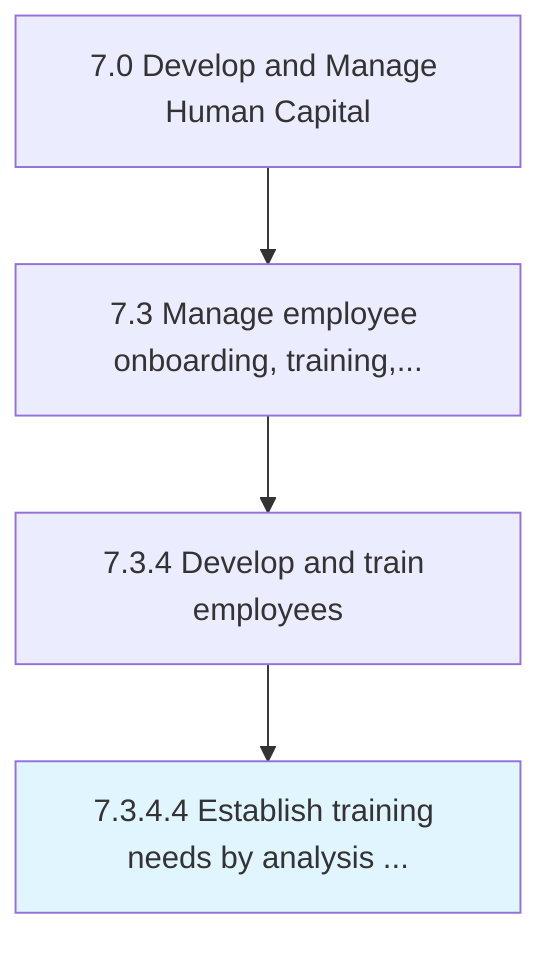

# Establish training needs by analysis of required and available skills

> Determining the training necessitated by business processes, using an examination of skill sets that are needed by the organization and those already possessed.

## Overview

Activity 7.3.4.4 is an activity within the Develop and Manage Human Capital framework. 

Determining the training necessitated by business processes, using an examination of skill sets that are needed by the organization and those already possessed. Examine the various skills required by individual employees. Design training in light of the availability of resources to provide specific segments of training.

## Process Hierarchy



## Key Statistics

| Metric | Value |
|--------|-------|
| APQC Code | 10492 |
| Hierarchy ID | 7.3.4.4 |
| Level | Activity |
| Parent | [7.3.4](../) |
| Sub-Processes | 0 |


## GraphDL Semantic Structure

```
establish.TrainingNeeds.by.AnalysisOfRequiredAndAvailableSkills
```

| Component | Value | Description |
|-----------|-------|-------------|
| Verb | `establish` | Primary action |
| Object | `training needs` | Direct object |
| Preposition | `by` | Relationship |
| PrepObject | `analysis of required and available skills` | Indirect object |


## Related Concepts

- [TrainingNeeds](/concepts/TrainingNeeds)
- [AnalysisOfRequiredSkills](/concepts/AnalysisOfRequiredSkills)
- [TrainingNeeds](/concepts/TrainingNeeds)
- [AvailableSkills](/concepts/AvailableSkills)


---

*Source: APQC PCF 10492 (7.3.4.4) - APQC*
