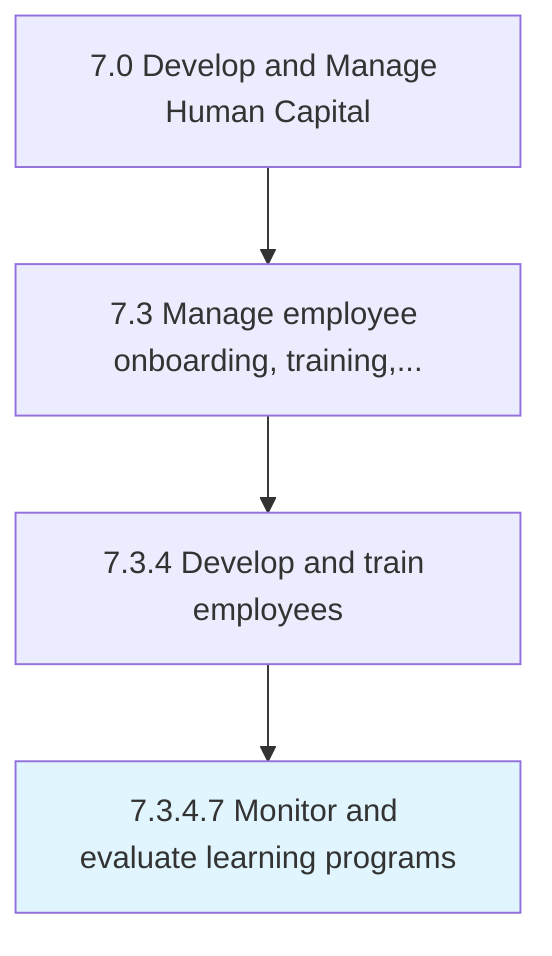

# Monitor and evaluate learning programs

> Oversight of the organization's learning programs.

## Overview

Activity 7.3.4.7 is an activity within the Develop and Manage Human Capital framework. 

Oversight of the organization's learning programs. This process also includes the effectiveness of these programs.

## Process Hierarchy



## Key Statistics

| Metric | Value |
|--------|-------|
| APQC Code | 21436 |
| Hierarchy ID | 7.3.4.7 |
| Level | Activity |
| Parent | [7.3.4](../) |
| Sub-Processes | 0 |


## GraphDL Semantic Structure

```
monitor.AndEvaluateLearningPrograms
```

| Component | Value | Description |
|-----------|-------|-------------|
| Verb | `monitor` | Primary action |
| Object | `and evaluate learning programs` | Direct object |


## Related Concepts

- LearningPrograms
- LearningPrograms


---

*Source: APQC PCF 21436 (7.3.4.7) - APQC*
