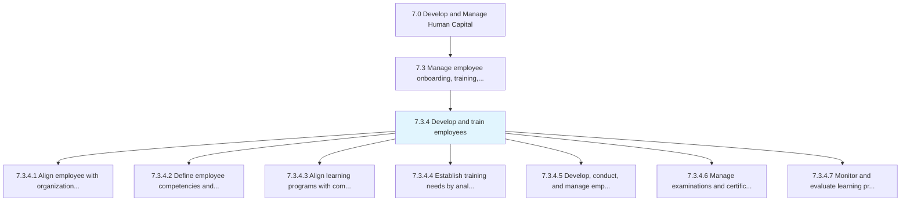
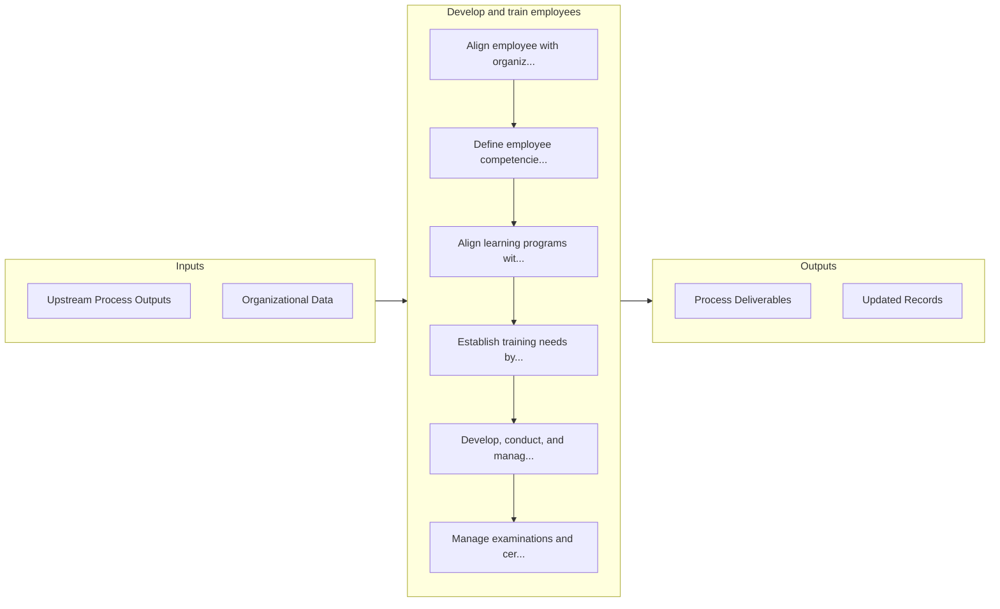

# Develop and train employees

> Creating a link between employee and organizational development needs.

## Overview

Process 7.3.4 is a core process that defines the specific procedures for develop and train employees. 

Creating a link between employee and organizational development needs. Conduct and manage employee training programs by considering the need and availability of these programs.

## Process Hierarchy



## Key Statistics

| Metric | Value |
|--------|-------|
| APQC Code | 10473 |
| Hierarchy ID | 7.3.4 |
| Level | Process |
| Parent | [7.3](../) |
| Sub-Processes | 7 |


## GraphDL Semantic Structure

```
develop.AndTrainEmployees
```

| Component | Value | Description |
|-----------|-------|-------------|
| Verb | `develop` | Primary action |
| Object | `and train employees` | Direct object |


## Process Flow



## Sub-Processes

| Process | Hierarchy ID | Description |
|---------|-------------|-------------|
| [Align employee with organization development needs](./AlignEmployeeWithOrganizationDevelopmentNeeds) | 7.3.4.1 | Aligning the needs of the employees to development needs |
| [Define employee competencies and skills](./DefineEmployeeCompetenciesAndSkills) | 7.3.4.2 | Defining the skills, knowledge, abilities, and attributes needed to carry out a specific job |
| [Align learning programs with competencies and skills](./AlignLearningProgramsWithCompetenciesAndSkills) | 7.3.4.3 | Aligning the learning programs with the core capabilities and competencies of the organization |
| [Establish training needs by analysis of required and available skills](./EstablishTrainingNeedsByAnalysisOfRequiredAndAvailableSkills) | 7.3.4.4 | Determining the training necessitated by business processes, using an examination of skill sets that |
| [Develop, conduct, and manage employee and/or management training programs](./DevelopConductAndManageEmployeeAndorManagementTrainingPrograms) | 7.3.4.5 | Creating, implementing, and managing the programs for training employees |
| [Manage examinations and certifications](./7.3.4.6-ManageExaminationsCertifications/) | 7.3.4.6 | Managing identified training programs for employees |
| [Monitor and evaluate learning programs](./MonitorAndEvaluateLearningPrograms) | 7.3.4.7 | Oversight of the organization's learning programs |


## Related Concepts

- Employees
- Employees


---

*Source: APQC PCF 10473 (7.3.4) - APQC*
