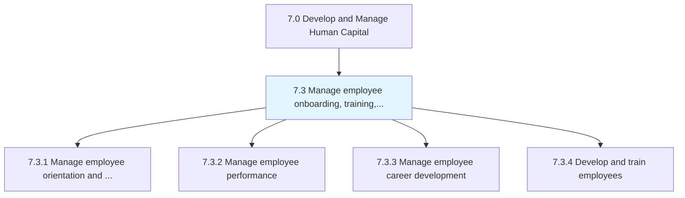
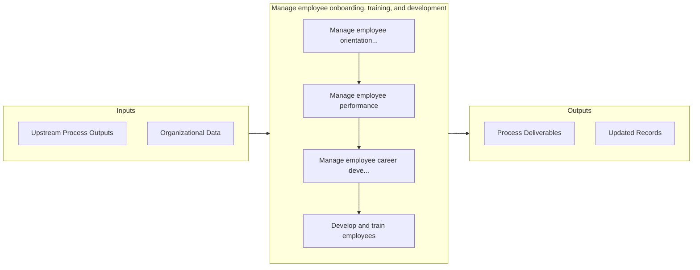

# Manage employee onboarding, training, and development

> Assisting employees in developing their capabilities, and providing them counseling services.

## Overview

Group 7.3 is a process group within APQC Category 7.0 (Develop and Manage Human Capital). 

Assisting employees in developing their capabilities, and providing them counseling services. Handle the orientation and deployment of the employees. Administer the performance of employees. Administer the development and enhancement of the employees. Provide training and development programs for employees.

## Process Hierarchy



## Key Statistics

| Metric | Value |
|--------|-------|
| APQC Code | 20599 |
| Hierarchy ID | 7.3 |
| Level | Group |
| Parent | [7](../) |
| Sub-Processes | 4 |


## GraphDL Semantic Structure

```graphdl
manage.EmployeeOnboardingTrainingAndDevelopment
```

| Component | Value | Description |
|-----------|-------|-------------|
| Verb | `manage` | Primary action |
| Object | `employee onboarding, training, and development` | Direct object |


## Process Flow



## Sub-Processes

| Process | Hierarchy ID | Description |
|---------|-------------|-------------|
| [Manage employee orientation and deployment](./7.3.1-ManageEmployeeOrientationDeployment/) | 7.3.1 | Creating and maintaining various employee on-boarding programs typically known as induction programs |
| [Manage employee performance](./7.3.2-ManageEmployeePerformance/) | 7.3.2 | Defining individual performance objectives |
| [Manage employee career development](./7.3.3-ManageEmployeeCareerDevelopment/) | 7.3.3 | Establishing employee development guidelines |
| [Develop and train employees](./7.3.4-DevelopTrainEmployees/) | 7.3.4 | Creating a link between employee and organizational development needs |


## Related Concepts

- EmployeeOnboarding
- Training
- Development


---

*Source: APQC PCF 20599 (7.3) - APQC*
