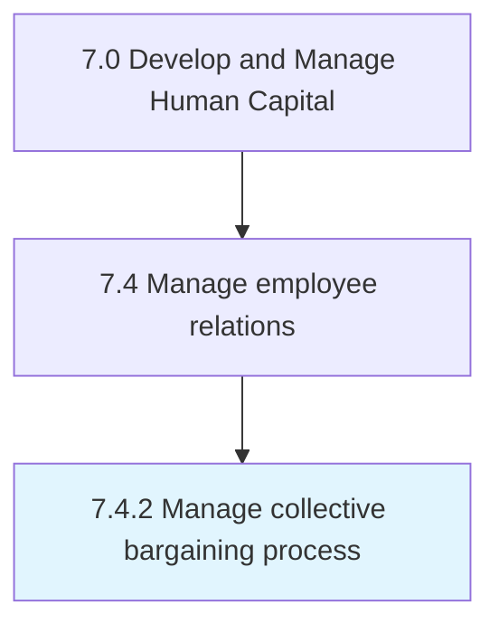

# Manage collective bargaining process

> Managing any negotiations between an employer and a group of employees that determine the conditions of employment.

## Overview

Process 7.4.2 is a core process that defines the specific procedures for manage collective bargaining process. 

Managing any negotiations between an employer and a group of employees that determine the conditions of employment. Engage employees to reach agreements in regulating working conditions.

## Process Hierarchy



## Key Statistics

| Metric | Value |
|--------|-------|
| APQC Code | 10484 |
| Hierarchy ID | 7.4.2 |
| Level | Process |
| Parent | [7.4](../) |
| Sub-Processes | 0 |


## GraphDL Semantic Structure

```
manage.CollectiveBargainingProcess
```

| Component | Value | Description |
|-----------|-------|-------------|
| Verb | `manage` | Primary action |
| Object | `collective bargaining process` | Direct object |


## Related Concepts

- CollectiveBargainingProcess


---

*Source: APQC PCF 10484 (7.4.2) - APQC*
