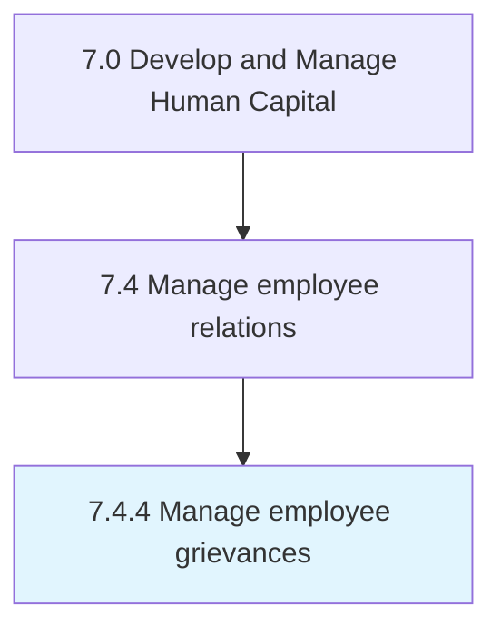

# Manage employee grievances

> Taking care or resolving any complaint raised by an employee by procedures provided for in a collective agreement, an employment contract, or by other mechanisms established by an employer.

## Overview

Process 7.4.4 is a core process that defines the specific procedures for manage employee grievances. 

Taking care or resolving any complaint raised by an employee by procedures provided for in a collective agreement, an employment contract, or by other mechanisms established by an employer.

## Process Hierarchy



## Key Statistics

| Metric | Value |
|--------|-------|
| APQC Code | 10531 |
| Hierarchy ID | 7.4.4 |
| Level | Process |
| Parent | [7.4](../) |
| Sub-Processes | 0 |


## GraphDL Semantic Structure

```
manage.EmployeeGrievances
```

| Component | Value | Description |
|-----------|-------|-------------|
| Verb | `manage` | Primary action |
| Object | `employee grievances` | Direct object |


## Related Concepts

- EmployeeGrievances


---

*Source: APQC PCF 10531 (7.4.4) - APQC*
