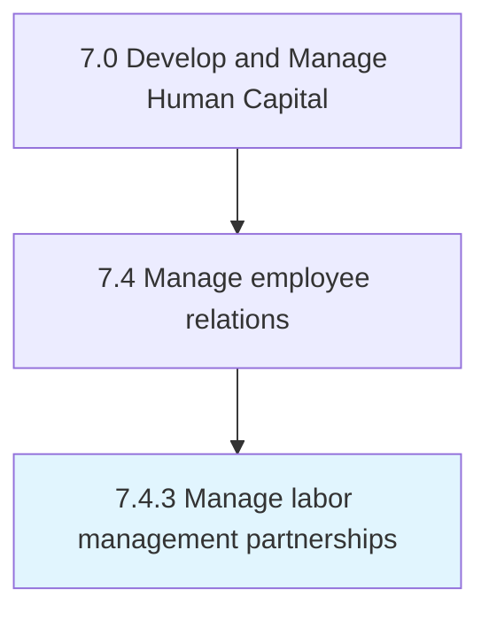
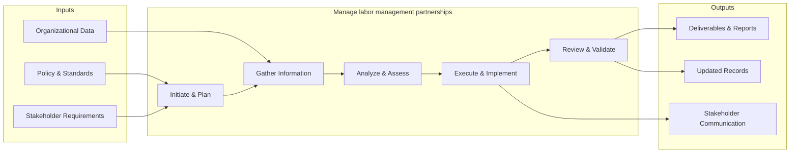

# Manage labor management partnerships

> Handling partnerships between labor and management.

## Overview

Process 7.4.3 is a core process that defines the specific procedures for manage labor management partnerships. 

Handling partnerships between labor and management. Develop a lasting two-way relationship that is beneficial for the labor, management, and the organization.

This process provides a structured approach to managing labor management partnerships across the organization. It includes establishing governance frameworks, defining operational procedures, monitoring performance, ensuring compliance with policies and regulations, and driving continuous improvement through data-driven insights.

## Process Hierarchy



## Key Statistics

| Metric | Value |
|--------|-------|
| APQC Code | 10485 |
| Hierarchy ID | 7.4.3 |
| Level | Process |
| Parent | [7.4](../) |
| Sub-Processes | 0 |


## GraphDL Semantic Structure

```graphdl
manage.LaborManagementPartnerships
```

| Component | Value | Description |
|-----------|-------|-------------|
| Verb | `manage` | Primary action |
| Object | `labor management partnerships` | Direct object |


## Related Concepts

- LaborManagementPartnerships


## Process Flow



## RACI Matrix

| Activity | Responsible | Accountable | Consulted | Informed |
|----------|------------|-------------|-----------|----------|
| Manage grievance | HR Specialist | HR Director | Legal Counsel | Department Head |
| Negotiate CBA | Labor Relations Specialist | CHRO | Legal Counsel | Union Members |
| Ensure compliance | HR Compliance Officer | HR Director | Legal Counsel | All Employees |

## Related Occupations

- [Human Resources Managers](/occupations/Management/HumanResourcesManagers)
- [Labor Relations Specialists](/occupations/Business/LaborRelationsSpecialists)
- [Lawyers](/occupations/Legal/Lawyers)
- [Compliance Officers](/occupations/Business/Operations/ComplianceOfficers)
- [Human Resources Specialists](/occupations/Business/Operations/HumanResourcesSpecialists)

## Related Departments

- Human Resources
- Legal
- Operations

## Industry Variations

### Manufacturing

Heavy emphasis on union relations, collective bargaining agreements, grievance arbitration procedures, and shop floor labor management.

### Public Sector

Governed by civil service rules, merit-based employment systems, public sector union agreements, and administrative law procedures.

### Healthcare

Manages relations across clinical and non-clinical staff, navigates nursing unions, and addresses patient safety-related labor concerns.

## KPIs & Metrics

| Metric | Description | Target |
|--------|-------------|--------|
| Grievance Resolution Time | Average days to resolve employee grievances | < 30 days |
| Employee Relations Case Volume | Number of ER cases per 100 employees annually | < 5 cases |
| Labor Dispute Frequency | Number of formal labor disputes per year | 0 disputes |
| Employee Satisfaction Score | Annual employee relations satisfaction survey score | > 4.0/5.0 |

---

*Source: APQC PCF 10485 (7.4.3) - APQC*
