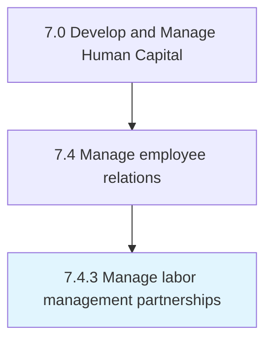

# Manage labor management partnerships

> Handling partnerships between labor and management.

## Overview

Process 7.4.3 is a core process that defines the specific procedures for manage labor management partnerships. 

Handling partnerships between labor and management. Develop a lasting two-way relationship that is beneficial for the labor, management, and the organization.

## Process Hierarchy



## Key Statistics

| Metric | Value |
|--------|-------|
| APQC Code | 10485 |
| Hierarchy ID | 7.4.3 |
| Level | Process |
| Parent | [7.4](../) |
| Sub-Processes | 0 |


## GraphDL Semantic Structure

```
manage.LaborManagementPartnerships
```

| Component | Value | Description |
|-----------|-------|-------------|
| Verb | `manage` | Primary action |
| Object | `labor management partnerships` | Direct object |


## Related Concepts

- LaborManagementPartnerships


---

*Source: APQC PCF 10485 (7.4.3) - APQC*
