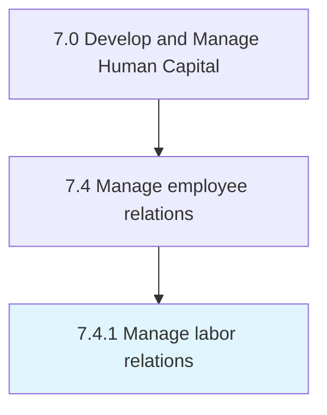

# Manage labor relations

> Managing labor relations, the collective bargaining process, and the relationships between the labor and management.

## Overview

Process 7.4.1 is a core process that defines the specific procedures for manage labor relations. 

Managing labor relations, the collective bargaining process, and the relationships between the labor and management. Take care of employee grievances.

## Process Hierarchy



## Key Statistics

| Metric | Value |
|--------|-------|
| APQC Code | 10483 |
| Hierarchy ID | 7.4.1 |
| Level | Process |
| Parent | [7.4](../) |
| Sub-Processes | 0 |


## GraphDL Semantic Structure

```
manage.LaborRelations
```

| Component | Value | Description |
|-----------|-------|-------------|
| Verb | `manage` | Primary action |
| Object | `labor relations` | Direct object |


## Related Concepts

- [LaborRelations](/concepts/LaborRelations)


---

*Source: APQC PCF 10483 (7.4.1) - APQC*
