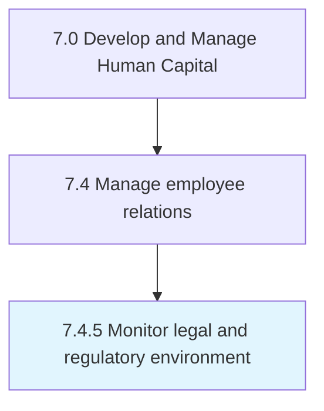

# Monitor legal and regulatory environment

> Awareness of the employee legislature that is in place for the organization.

## Overview

Process 7.4.5 is a core process that defines the specific procedures for monitor legal and regulatory environment. 

Awareness of the employee legislature that is in place for the organization. The regulatory environment could include areas, regions, or countries.

## Process Hierarchy



## Key Statistics

| Metric | Value |
|--------|-------|
| APQC Code | 21437 |
| Hierarchy ID | 7.4.5 |
| Level | Process |
| Parent | [7.4](../) |
| Sub-Processes | 0 |


## GraphDL Semantic Structure

```
monitor.LegalAndRegulatoryEnvironment
```

| Component | Value | Description |
|-----------|-------|-------------|
| Verb | `monitor` | Primary action |
| Object | `legal and regulatory environment` | Direct object |


## Related Concepts

- [LegalEnvironment](/concepts/LegalEnvironment)
- [RegulatoryEnvironment](/concepts/RegulatoryEnvironment)


---

*Source: APQC PCF 21437 (7.4.5) - APQC*
