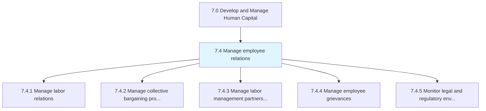
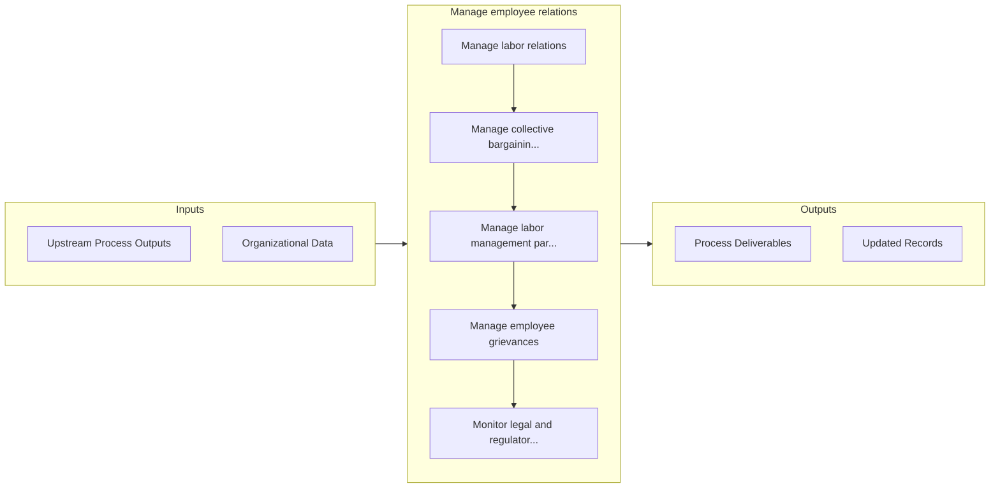

# Manage employee relations

> Assisting general management in developing, maintaining, and improving employee relationships.

## Overview

Group 7.4 is a process group within APQC Category 7.0 (Develop and Manage Human Capital). 

Assisting general management in developing, maintaining, and improving employee relationships. This is accomplished through communication, performance management, processing grievances, and/or dispute. Interpret and convey organizational policies.

## Process Hierarchy



## Key Statistics

| Metric | Value |
|--------|-------|
| APQC Code | 17052 |
| Hierarchy ID | 7.4 |
| Level | Group |
| Parent | [7](../) |
| Sub-Processes | 5 |


## GraphDL Semantic Structure

```
manage.EmployeeRelations
```

| Component | Value | Description |
|-----------|-------|-------------|
| Verb | `manage` | Primary action |
| Object | `employee relations` | Direct object |


## Process Flow



## Sub-Processes

| Process | Hierarchy ID | Description |
|---------|-------------|-------------|
| [Manage labor relations](./ManageLaborRelations) | 7.4.1 | Managing labor relations, the collective bargaining process, and the relationships between the labor |
| [Manage collective bargaining process](./ManageCollectiveBargainingProcess) | 7.4.2 | Managing any negotiations between an employer and a group of employees that determine the conditions |
| [Manage labor management partnerships](./ManageLaborManagementPartnerships) | 7.4.3 | Handling partnerships between labor and management |
| [Manage employee grievances](./ManageEmployeeGrievances) | 7.4.4 | Taking care or resolving any complaint raised by an employee by procedures provided for in a collect |
| [Monitor legal and regulatory environment](./MonitorLegalAndRegulatoryEnvironment) | 7.4.5 | Awareness of the employee legislature that is in place for the organization |


## Related Concepts

- EmployeeRelations


---

*Source: APQC PCF 17052 (7.4) - APQC*
