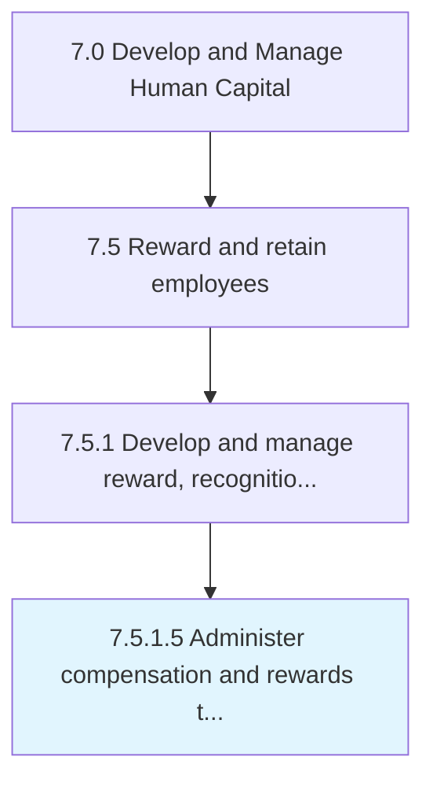

# Administer compensation and rewards to employees

> Managing the provision of compensations and rewards to the employees while maintaining consistency with the compensation and benefits plan.

## Overview

Activity 7.5.1.5 is an activity within the Develop and Manage Human Capital framework. 

Managing the provision of compensations and rewards to the employees while maintaining consistency with the compensation and benefits plan. Follow the compensation and benefits plan rigorously in order to avoid any discrepancies.

## Process Hierarchy



## Key Statistics

| Metric | Value |
|--------|-------|
| APQC Code | 10502 |
| Hierarchy ID | 7.5.1.5 |
| Level | Activity |
| Parent | [7.5.1](../) |
| Sub-Processes | 0 |


## GraphDL Semantic Structure

```
administer.CompensationAndRewards.to.Employees
```

| Component | Value | Description |
|-----------|-------|-------------|
| Verb | `administer` | Primary action |
| Object | `compensation and rewards` | Direct object |
| Preposition | `to` | Relationship |
| PrepObject | `employees` | Indirect object |


## Related Concepts

- [Compensation](/concepts/Compensation)
- [Employees](/concepts/Employees)
- [Rewards](/concepts/Rewards)
- [Employees](/concepts/Employees)


---

*Source: APQC PCF 10502 (7.5.1.5) - APQC*
