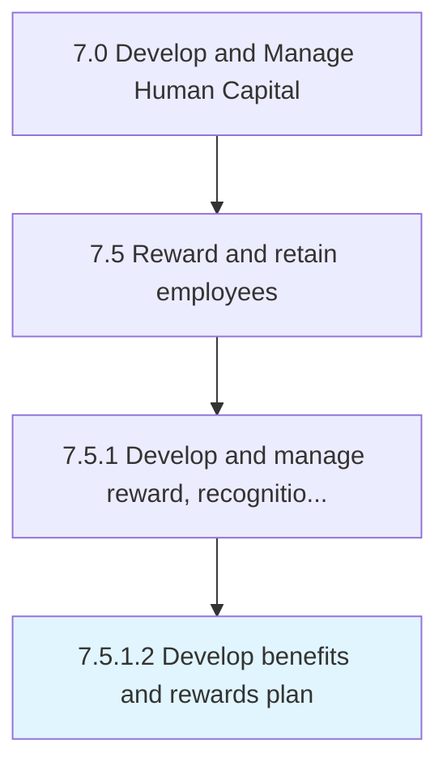

# Develop benefits and rewards plan

> Developing a plan for provision of rewards, commission, and benefits to employees.

## Overview

Activity 7.5.1.2 is an activity within the Develop and Manage Human Capital framework. 

Developing a plan for provision of rewards, commission, and benefits to employees. Plan health benefits, retirement benefits, non-monetary benefits, etc.

## Process Hierarchy



## Key Statistics

| Metric | Value |
|--------|-------|
| APQC Code | 10499 |
| Hierarchy ID | 7.5.1.2 |
| Level | Activity |
| Parent | [7.5.1](../) |
| Sub-Processes | 0 |


## GraphDL Semantic Structure

```
develop.BenefitsAndRewardsPlan
```

| Component | Value | Description |
|-----------|-------|-------------|
| Verb | `develop` | Primary action |
| Object | `benefits and rewards plan` | Direct object |


## Related Concepts

- Benefits
- RewardsPlan


---

*Source: APQC PCF 10499 (7.5.1.2) - APQC*
