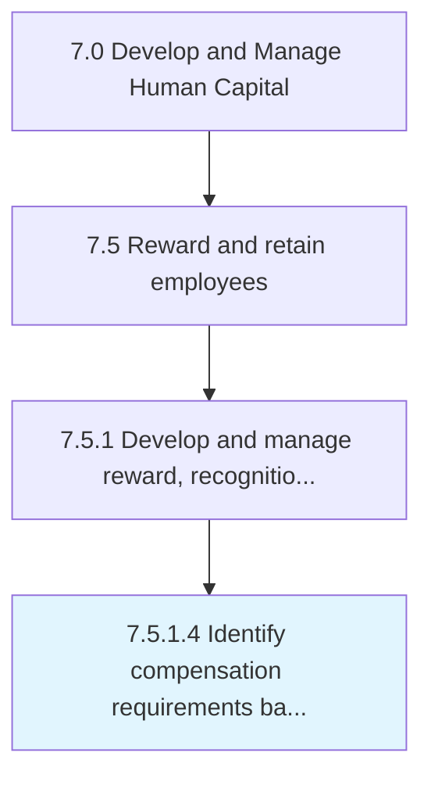

# Identify compensation requirements based on financial, benefits, and HR policies

> Recognizing the employee requirements for compensation on the basis of the financial, benefits, and HR policies of the organization.

## Overview

Activity 7.5.1.4 is an activity within the Develop and Manage Human Capital framework. 

Recognizing the employee requirements for compensation on the basis of the financial, benefits, and HR policies of the organization. Recognize individual compensation requirements regarding the financial policies of the organization. Consider the benefits plan and overall HR policies while selecting compensation requirements.

## Process Hierarchy



## Key Statistics

| Metric | Value |
|--------|-------|
| APQC Code | 10501 |
| Hierarchy ID | 7.5.1.4 |
| Level | Activity |
| Parent | [7.5.1](../) |
| Sub-Processes | 0 |


## GraphDL Semantic Structure

```
identify.CompensationRequirementsBased.on.FinancialBenefitsAndHRPolicies
```

| Component | Value | Description |
|-----------|-------|-------------|
| Verb | `identify` | Primary action |
| Object | `compensation requirements based` | Direct object |
| Preposition | `on` | Relationship |
| PrepObject | `financial, benefits, and HR policies` | Indirect object |


## Related Concepts

- [CompensationRequirementsBased](/concepts/CompensationRequirementsBased)
- [Financial](/concepts/Financial)
- [CompensationRequirementsBased](/concepts/CompensationRequirementsBased)
- [Benefits](/concepts/Benefits)
- [CompensationRequirementsBased](/concepts/CompensationRequirementsBased)
- [HRPolicies](/concepts/HRPolicies)


---

*Source: APQC PCF 10501 (7.5.1.4) - APQC*
