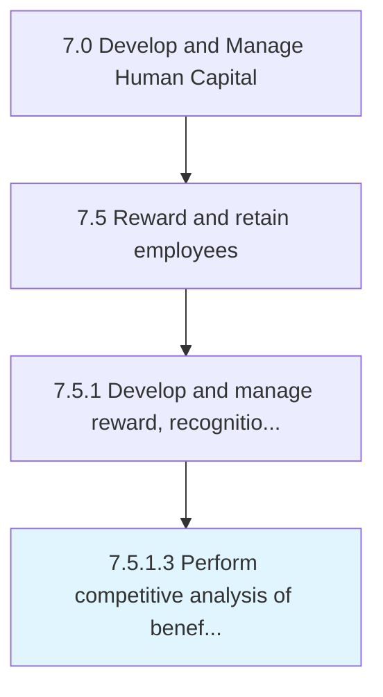

# Perform competitive analysis of benefits and rewards

> Analyzing and evaluating the organization's benefits and rewards plan.

## Overview

Activity 7.5.1.3 is an activity within the Develop and Manage Human Capital framework. 

Analyzing and evaluating the organization's benefits and rewards plan. Compare/Benchmark the benefits and employees plan with other organizations to adhere to industry standard practices.

## Process Hierarchy



## Key Statistics

| Metric | Value |
|--------|-------|
| APQC Code | 10500 |
| Hierarchy ID | 7.5.1.3 |
| Level | Activity |
| Parent | [7.5.1](../) |
| Sub-Processes | 0 |


## GraphDL Semantic Structure

```
perform.CompetitiveAnalysis.of.BenefitsAndRewards
```

| Component | Value | Description |
|-----------|-------|-------------|
| Verb | `perform` | Primary action |
| Object | `competitive analysis` | Direct object |
| Preposition | `of` | Relationship |
| PrepObject | `benefits and rewards` | Indirect object |


## Related Concepts

- CompetitiveAnalysis
- Benefits
- CompetitiveAnalysis
- Rewards


---

*Source: APQC PCF 10500 (7.5.1.3) - APQC*
