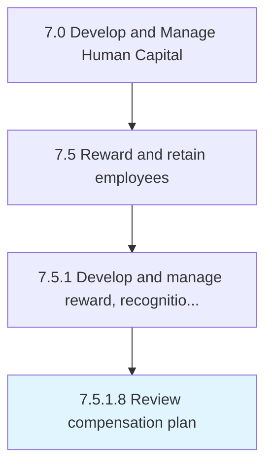

# Review compensation plan

> Analyzing existing compensation plans and making changes necessary to continue to retain employees.

## Overview

Activity 7.5.1.8 is an activity within the Develop and Manage Human Capital framework. 

Analyzing existing compensation plans and making changes necessary to continue to retain employees.

## Process Hierarchy



## Key Statistics

| Metric | Value |
|--------|-------|
| APQC Code | 10511 |
| Hierarchy ID | 7.5.1.8 |
| Level | Activity |
| Parent | [7.5.1](../) |
| Sub-Processes | 0 |


## GraphDL Semantic Structure

```
review.CompensationPlan
```

| Component | Value | Description |
|-----------|-------|-------------|
| Verb | `review` | Primary action |
| Object | `compensation plan` | Direct object |


## Related Concepts

- CompensationPlan


---

*Source: APQC PCF 10511 (7.5.1.8) - APQC*
