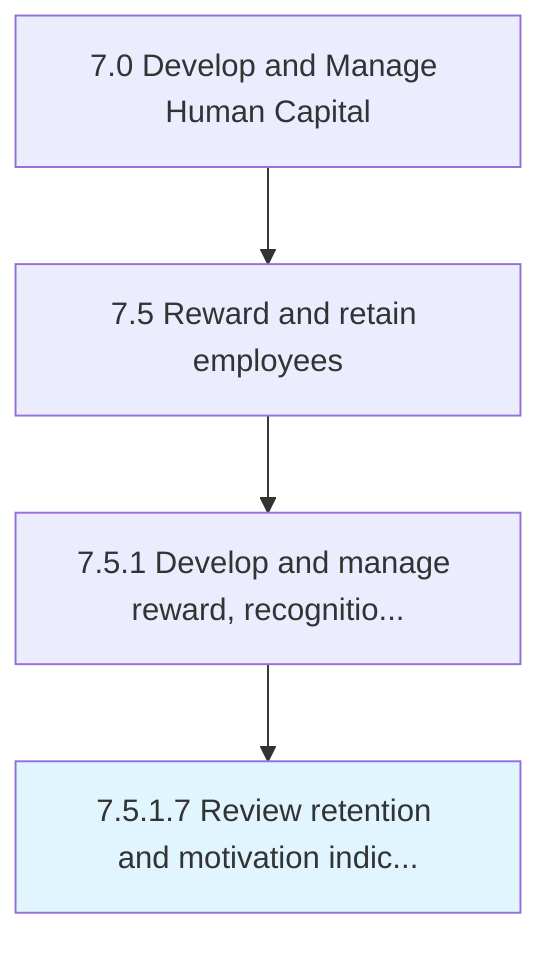

# Review retention and motivation indicators

> Reassessing the indicators for retention and motivation of employees.

## Overview

Activity 7.5.1.7 is an activity within the Develop and Manage Human Capital framework. 

Reassessing the indicators for retention and motivation of employees. Monitor the indicators that signal the levels of motivation and retention. Regularly update and upgrade indicators to avoid depreciation and ensure high efficiency.

## Process Hierarchy



## Key Statistics

| Metric | Value |
|--------|-------|
| APQC Code | 10510 |
| Hierarchy ID | 7.5.1.7 |
| Level | Activity |
| Parent | [7.5.1](../) |
| Sub-Processes | 0 |


## GraphDL Semantic Structure

```
review.RetentionAndMotivationIndicators
```

| Component | Value | Description |
|-----------|-------|-------------|
| Verb | `review` | Primary action |
| Object | `retention and motivation indicators` | Direct object |


## Related Concepts

- [RetentionIndicators](/concepts/RetentionIndicators)
- [MotivationIndicators](/concepts/MotivationIndicators)


---

*Source: APQC PCF 10510 (7.5.1.7) - APQC*
