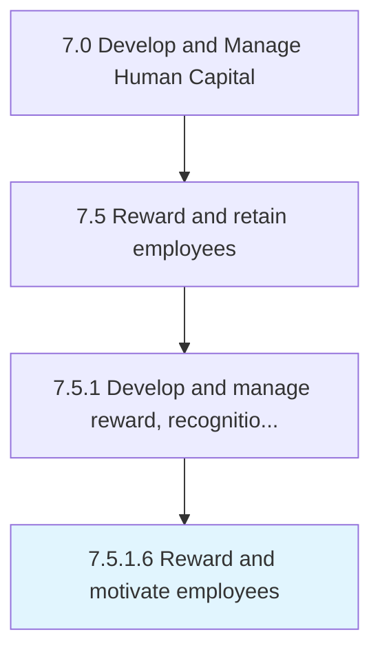

# Reward and motivate employees

> Rewarding and stimulating the performance efforts of employees.

## Overview

Activity 7.5.1.6 is an activity within the Develop and Manage Human Capital framework. 

Rewarding and stimulating the performance efforts of employees. Create methods for motivating employees. Spur extrinsic and intrinsic motivation.

## Process Hierarchy



## Key Statistics

| Metric | Value |
|--------|-------|
| APQC Code | 10503 |
| Hierarchy ID | 7.5.1.6 |
| Level | Activity |
| Parent | [7.5.1](../) |
| Sub-Processes | 0 |


## GraphDL Semantic Structure

```
reward.AndMotivateEmployees
```

| Component | Value | Description |
|-----------|-------|-------------|
| Verb | `reward` | Primary action |
| Object | `and motivate employees` | Direct object |


## Related Concepts

- [Employees](/concepts/Employees)
- [Employees](/concepts/Employees)


---

*Source: APQC PCF 10503 (7.5.1.6) - APQC*
