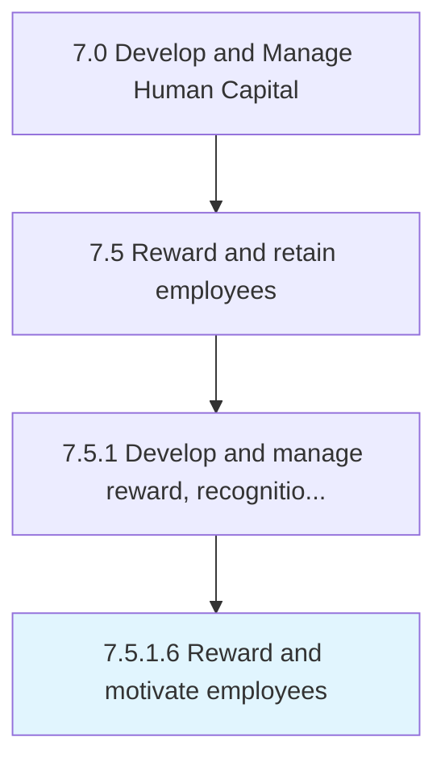
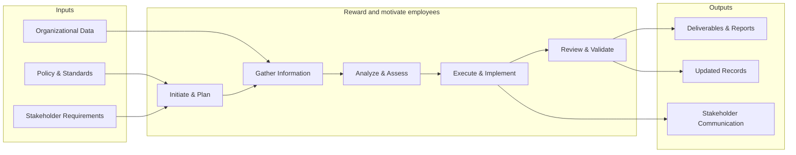

# Reward and motivate employees

> Rewarding and stimulating the performance efforts of employees.

## Overview

Activity 7.5.1.6 is an activity within the Develop and Manage Human Capital framework. 

Rewarding and stimulating the performance efforts of employees. Create methods for motivating employees. Spur extrinsic and intrinsic motivation.

This process manages the recognition and reward of and motivate employees. It involves identifying eligible recipients, selecting appropriate rewards, administering recognition programs, and measuring the impact on motivation and retention.

## Process Hierarchy



## Key Statistics

| Metric | Value |
|--------|-------|
| APQC Code | 10503 |
| Hierarchy ID | 7.5.1.6 |
| Level | Activity |
| Parent | [7.5.1](../) |
| Sub-Processes | 0 |


## GraphDL Semantic Structure

```graphdl
reward.AndMotivateEmployees
```

| Component | Value | Description |
|-----------|-------|-------------|
| Verb | `reward` | Primary action |
| Object | `and motivate employees` | Direct object |


## Related Concepts

- Employees
- Employees


## Process Flow



## RACI Matrix

| Activity | Responsible | Accountable | Consulted | Informed |
|----------|------------|-------------|-----------|----------|
| Design compensation plan | Compensation Analyst | Compensation Manager | Finance | HR Director |
| Administer benefits | Benefits Specialist | Benefits Manager | Vendors | Employees |
| Process payroll | Payroll Specialist | Payroll Manager | Finance | Employees |

## Related Occupations

- [Compensation and Benefits Managers](/occupations/Management/CompensationAndBenefitsManagers)
- [Compensation, Benefits, and Job Analysis Specialists](/occupations/Business/CompensationBenefitsAndJobAnalysisSpecialists)
- [Human Resources Managers](/occupations/Management/HumanResourcesManagers)
- [Payroll and Timekeeping Clerks](/occupations/Administrative/PayrollAndTimekeepingClerks)
- [Financial Analysts](/occupations/Business/Financial/FinancialAnalysts)

## Related Departments

- Human Resources
- Finance
- Payroll

## Industry Variations

### Technology

Emphasizes stock options/RSUs, signing bonuses, flexible PTO policies, wellness stipends, and competitive total compensation benchmarking.

### Healthcare

Includes shift differentials, on-call pay, malpractice coverage, continuing education reimbursement, and loan forgiveness programs.

### Financial Services

Features performance-based bonuses, deferred compensation, profit sharing, comprehensive insurance packages, and regulatory-compliant incentive structures.

## KPIs & Metrics

| Metric | Description | Target |
|--------|-------------|--------|
| Total Compensation Competitiveness | Percentile ranking vs. market benchmarks | 50th-75th percentile |
| Benefits Utilization Rate | Percentage of employees actively using benefit programs | > 80% |
| Voluntary Turnover Rate | Annual voluntary employee departures as percentage of headcount | < 12% |
| Compensation Equity Ratio | Pay equity across demographic groups | 0.98-1.02 |

---

*Source: APQC PCF 10503 (7.5.1.6) - APQC*
