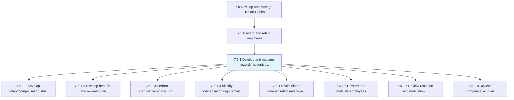
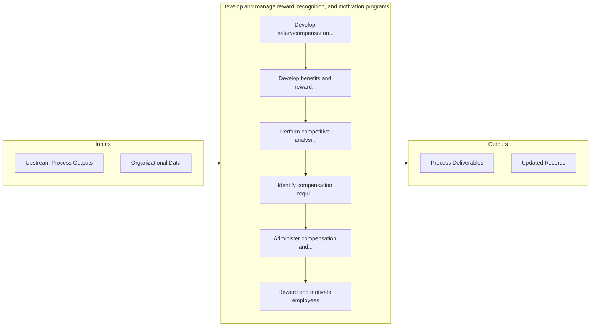

# Develop and manage reward, recognition, and motivation programs

> Developing a salary/compensation structure and plan; developing a benefits and reward plan; develop commission plan; performing competitive analyses of benefits and rewards; identifying compensation requirements based on compensation, benefits, and HR policies; administering compensation, commission, and rewards to employees; and rewarding and motivating employees.

## Overview

Process 7.5.1 is a core process that defines the specific procedures for develop and manage reward, recognition, and motivation programs. 

Developing a salary/compensation structure and plan; developing a benefits and reward plan; develop commission plan; performing competitive analyses of benefits and rewards; identifying compensation requirements based on compensation, benefits, and HR policies; administering compensation, commission, and rewards to employees; and rewarding and motivating employees.

## Process Hierarchy



## Key Statistics

| Metric | Value |
|--------|-------|
| APQC Code | 21438 |
| Hierarchy ID | 7.5.1 |
| Level | Process |
| Parent | [7.5](../) |
| Sub-Processes | 8 |


## GraphDL Semantic Structure

```
develop.AndManageRewardRecognitionAndMotivationPrograms
```

| Component | Value | Description |
|-----------|-------|-------------|
| Verb | `develop` | Primary action |
| Object | `and manage reward, recognition, and motivation programs` | Direct object |


## Process Flow



## Sub-Processes

| Process | Hierarchy ID | Description |
|---------|-------------|-------------|
| [Develop salary/compensation structure and plan](./DevelopSalarycompensationStructureAndPlan) | 7.5.1.1 | Creating the framework for the provision of salary/compensation to employees |
| [Develop benefits and rewards plan](./DevelopBenefitsAndRewardsPlan) | 7.5.1.2 | Developing a plan for provision of rewards, commission, and benefits to employees |
| [Perform competitive analysis of benefits and rewards](./PerformCompetitiveAnalysisOfBenefitsAndRewards) | 7.5.1.3 | Analyzing and evaluating the organization's benefits and rewards plan |
| [Identify compensation requirements based on financial, benefits, and HR policies](./IdentifyCompensationRequirementsBasedOnFinancialBenefitsAndHRPolicies) | 7.5.1.4 | Recognizing the employee requirements for compensation on the basis of the financial, benefits, and  |
| [Administer compensation and rewards to employees](./AdministerCompensationAndRewardsToEmployees) | 7.5.1.5 | Managing the provision of compensations and rewards to the employees while maintaining consistency w |
| [Reward and motivate employees](./RewardAndMotivateEmployees) | 7.5.1.6 | Rewarding and stimulating the performance efforts of employees |
| [Review retention and motivation indicators](./ReviewRetentionAndMotivationIndicators) | 7.5.1.7 | Reassessing the indicators for retention and motivation of employees |
| [Review compensation plan](./ReviewCompensationPlan) | 7.5.1.8 | Analyzing existing compensation plans and making changes necessary to continue to retain employees |


## Related Concepts

- [Reward](/concepts/Reward)
- [Recognition](/concepts/Recognition)
- [MotivationPrograms](/concepts/MotivationPrograms)
- [Reward](/concepts/Reward)
- [Recognition](/concepts/Recognition)
- [MotivationPrograms](/concepts/MotivationPrograms)


---

*Source: APQC PCF 21438 (7.5.1) - APQC*
