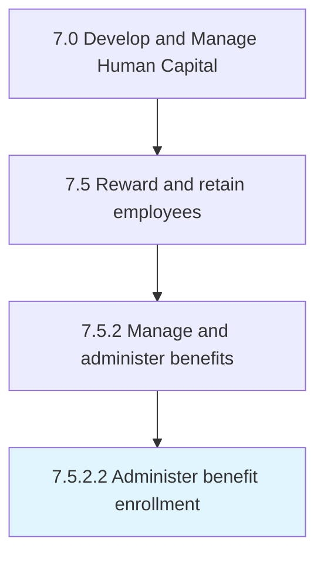

# Administer benefit enrollment

> Handling the employee enrollment for obtaining benefits.

## Overview

Activity 7.5.2.2 is an activity within the Develop and Manage Human Capital framework. 

Handling the employee enrollment for obtaining benefits. Manage employee enrollment and eligibility. Encourage employees to enroll for benefits.

## Process Hierarchy



## Key Statistics

| Metric | Value |
|--------|-------|
| APQC Code | 10505 |
| Hierarchy ID | 7.5.2.2 |
| Level | Activity |
| Parent | [7.5.2](../) |
| Sub-Processes | 0 |


## GraphDL Semantic Structure

```
administer.BenefitEnrollment
```

| Component | Value | Description |
|-----------|-------|-------------|
| Verb | `administer` | Primary action |
| Object | `benefit enrollment` | Direct object |


## Related Concepts

- BenefitEnrollment


---

*Source: APQC PCF 10505 (7.5.2.2) - APQC*
